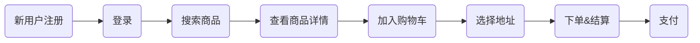

# [REST API Testing Strategy: What Exactly Should You Test?](https://www.sisense.com/blog/rest-api-testing-strategy-what-exactly-should-you-test/)


# [API testing strategy: Who is testing your API-driven product?](https://apifriends.com/api-management/api-testing-strategy/)


# [接口测试用例设计实践总结](https://www.cnblogs.com/shouke/p/10157811.html)


# [接口测试用例到底应该怎么写](https://testerhome.com/topics/11744)


# [接口测试的总结文档](https://www.cnblogs.com/xiaowenshu/p/10346903.html)


# [接口测试流程及用例设计](https://zhuanlan.zhihu.com/p/73711479)

接口测试是整个项目测试过程中非常重要的一环,测试的对象是接口,所以可以很早的介入测试,对代码逻辑进行全面验证,更早的发现程序问题,比 UI 测试效率更高, 并且更容易验证极端和异常情况.

## 接口测试流程

类似于功能测试流程,一个完整的接口测试流程如下:

1. 分析接口文档和需求文档
2. 编写接口测试计划
3. 编写接口测试用例
4. 接口测试执行
5. 输出接口测试报告.

一般接口用例设计依据的就是开发提供的接口文档和产品需求文档,首先认识一下接口文档

## 接口文档

## 主要部分

## 接口用例设计原则

## 如何确定用例覆盖率

## 一般接口用例组成部分


# [接口测试用例设计](https://mp.weixin.qq.com/s/DqlArsqESYyTQzE-aDCkjw)

## 导语

随着测试分析和分层测试的深化,“接口测试”出现在我们视野的频次越来越高.那么接口测试的用例设计常用哪些方法,本文将详细描述.

## 接口测试

### 接口测试

接口:主要是子模块或者子系统间交互并相互作用的部分.

这里说的接口是广义的,客户端与后台服务间的协议;插件间通信的接口;模块间的接口;再小到一个类提供的方法都可以理解为接口.

接口测试:是指针对模块或系统间接口进行的测试.

### 接口测试发现的典型问题

接口测试经常遇到的 bug 和问题如下:

1. 传入参数处理不当,导致程序 crash
2. 类型溢出,导致数据读出和写入不一致
3. 因对象权限未进行校验,可以访问其他用户敏感信息
4. 状态处理不当,导致逻辑出现错乱
5. 逻辑校验不完善,可利用漏洞获取非正当利益等.

## 接口测试用例设计


上图为一个典型的接口. 一个接口通常是有输入输出的,输入就是我们常见的入参,输出有时有,有时没有.调用相关接口,接口会执行相关处理逻辑.

接口测试的用例设计,主要从输入和接口处理两方面考虑:

1. 针对输入,可按照参数类型进行设计
2. 针对接口处理,可按照逻辑进行用例设计
3. 针对输出,可根据结果进行分析设计

### 针对输入设计


对于接口来说,输入就是入参.常见的参数类型有:

1. 数值型(int, long, float, double 等)
2. 字符串类型
3. 数组或链表
4. 结构体


结构体(struct)是一些元素的结合,元素实际也是数值型,字符串型,数组或链表.

#### 数值型

数值型的参数主要考虑以下几个方面设计：


如果参数规定了值的范围，则需要考虑等价类取值范围内、取值范围外、取值的边界，如有需要，可能会遍历取值范围内的各个值。

例如检查权限的接口：`TaskChecker.checkTask(int taskID)` `taskID` 的取值范围是1-35，那么设计时考虑：

* 1-35范围内和范围外的值
* 1-35的边界：0,1,35,36
* 类型的特殊值：-1,0
* 数据类型的边界值：int的最小值最大值
* 因为1-35代码的权限 ID 不同，可能需要遍历1-35的每个值

常见的问题和风险：

* 特殊值处理不当导致程序异常退出
* 类型边界溢出
* 取值范围外值未返回正确的错误信息等

#### 字符串型

字符串类型的参数，主要考虑字符串的长度和内容：


例如接口转换设置闹钟的接口 `DateUtil.getDayOfDDHH(String ddhh)`,用例可以考虑：

* 长度为4位，比4位少，比4位多
* 边界值：String的最大长度
* 特殊值：空字符
* 字符串内容可考虑类型：数字，非数字
* 特殊字符
* 如果是输入用户输入且其他用户可见的内容，则还需要考虑敏感字是否被正常过滤

可能出现的问题和风险：

* 传入非特定类型程序异常退出
* 超长字符未进行处理，导致存储、显示等异常
* 其他用户可见设置的敏感字

#### 数组或链表类型

参数类型为数组或链表时，用例可以考虑：


例如批量提交任务的接口 `submitTastk(int[] taskID)`，参数用例设计考虑：

1. 正常取值：1-5 个权限，范围外：6个权限
2. 边界值：1-35 的边界值，请求允许最大值最小值
3. 特殊值：0个
4. 合法 ID 和不合法的
5. 重复的 ID 等

可能存在的问题和风险：

1. 0 个 item 时程序异常退出
2. 重复的 item 处理时未去重导致结果异常等

### 针对逻辑设计


接口需要进行一些逻辑处理的，那么按逻辑设计用例可以从以下几个角度分析

#### 约束条件分析

* 数值限制：分数限制、金币限制、等级限制等等

	例如：兑换 Q 币活动要求积分 > 50 才可参与

* 状态限制：登录状态等

	例如：同步用户信息需要先登录账号

* 关系限制：绑定的关系，好友关系等

	例如：帮家人防骗功能只能查询绑定家人的来电信息

* 权限限制：管理员等

约束条件的测试在功能测试中经常遇到，在接口测试中更为重要。它的意义在于：用户进行操作时，在该操作的前端可能已经进行了约束条件的限制，故用户无法直接触发请求该接口。但是实际上，如果有其他手段：例如 UI 有 bug 或者通过技术手段直接调用接口，那么接口是否针对这些条件进行了限制就尤为重要。

例如常见的例子：要兑换5 Q币需要200积分，但是我积分不足，所以兑换按钮是灰色无法点击的状态：


正常用户是无法操作的，但是兑换其实是调后台的一个接口，如果绕过页面按钮的限制，直接调用后台接口兑换呢？是否可以兑换？预期当然是不能兑换的。因此积分这个数值限制就需要针对接口进行测试，并且非常重要。

其他约束条件类似：

* 时间约束：22: 00 之前
* 数值约束：积分 200；限量 5 个
* 状态约束：登录手机管家
* 等等约束条件类似

常见的问题和风险

* 约束条件判断不足，导致用户可通过特殊手段获取利益

#### 操作对象分析

操作通常是针对对象的，例如用户绑定电话号码，电话号码就是操作对象，而这个电话号码的话费、流量也是对象。


对象分析主要是针对合法和不合法对象进行操作。例如下述举例：

* 用户 A 查询电话 `P1` 话费
* 用户 A 查询电话 `P1` 流量
* 用户 A 查询电话 `P2` 话费
* 用户 A 查询电话 `P2` 流量

后台的逻辑处理，如果一个电话已经被绑定过，从后台的角度是可以查询到该电话的话费和流量的。但是在用户侧，应该是 A 绑定了电话，才能让 A 查询到该电话的话费。故类似对象的测试也必不可少。

常见的问题和风险：

* 用户可以访问非权限内的其他用户信息、敏感信息，从而利用这些信息谋取利益。

#### 状态转换分析

被测逻辑可以抽象成状态机，各个状态之间根据功能逻辑从一个状态切换到另一个状态。如果我们打乱了这个次序，从一个状态切换到另一个不在它下一状态中的状态，那么逻辑将会打乱，就会出现逻辑问题。


如上图所示，从某状态改变到新的状态，依赖于转换接口。而对于某转换接口，其输入状态是确定的，比如`Fun23`，这个函数只能把状态2转换为状态3，而不能把状态1转换为状态3，那么测试点就可以是：

1. 状态为状态2，调用接口`Fun23()`，状态切换到状态23
2. 状态为1,3 等，调用接口`Fun23()`，状态不能切换

例如在做任务的时候，任务有三种状态：未领取，已领取未提交，已完成三种状态


那么可以这样设计：

1. 正常状态切换：未领取状态，领取任务后变为已领取状态；已领取满足任务条件提交后，变成已完成状态；完成后可以再次领取任务
2. 非正常的状态切换：未领取任务满足任务条件直接提交任务；已领取时再次领取任务等等。

常见的问题和风险：

可通过特殊手段达到原本不能的状态，从而谋取利益。

#### 时序分析

在一些复杂的活动中，一个活动是由一系列动作按照指定顺序进行的，这些动作形成一个动作流，只有按照这个顺序依次执行，才能得到预期结果。

在正常的流程里这些动作是根据程序调用依次进行的，并不会打乱，在接口测试时，需要考虑如果不按时序执行，是否会出现问题。

例如，客户端数据同步是由客户端触发进行的，期间的同步用户无法干预。功能测试的时候可见的就是是否能正常进行同步，而进一步分析，同步流程实际涉及了一组动作：


从时序图可以看出，后台有3个接口：登录获取用户 ID，上报本地数据，上报本地冲突。三个接口需要依次调用执行，才能完成同步。那么在接口测试就可以考虑打乱上述接口的执行顺序去执行会有怎样的结果，是否会出现异常。例如：获取用户 ID 后不上报本地数据而直接上报本地冲突。

常见的问题和风险：

* 非顺序执行后，数据出现异常，可能还会出现程序其他异常
* 通过打乱顺序获取利益

### 针对输出设计


针对输出设计其实是针对接口返回的结果进行分析.

#### 针对输出结果

接口处理正确的结果可能只有一个,但是错误异常返回结果有很多情况很多值.如果知道返回结果有很多种,就可以针对不同结果设计用例.例如提交积分任务的时候我们通常能想到的是返回正常和错误,错误可能想到:无效任务,无效登录态,但是不一定能否完全覆盖所有错误码,而接口返回定义的返回码可以设计更多用例:


覆盖返回码也是用例设计的一种思路.

常见问题和风险:

1. 错误前端处理不足,导致前端异常
2. 错误提示处理不当,导致用户看到晦涩的错误码
3. 错误提示不当,导致用户不知道哪里出了问题,如何解决.

#### 接口超时

接口正常情况下是有返回的,那么如果接口不返回呢?也就是说接口超时后的处理也是测试需要考虑的部分.如果超时处理不当,可能会引起以下问题:

1. 未进行超时处理,导致整个流程阻塞
2. 超时后又收到接口返回,导致逻辑出现错乱

### 其他测试设计

#### 已废弃接口测试

已废弃协议，是指之前有定义，但是因为需求变更或其他原因，目前版本不用。这些几口虽然不再使用，但有可能代码并没有及时删除。如果利用技术手段调用这些接口，可能获取额外利益。

例如，之前有个清理任务，在一个版本需求里将清理任务替换为下载任务。在新版本客户端已不再调用完成清理任务的接口；但是如果该接口未关闭，用户就可以继续请求`submitTask`(int `taskID`)接口完成清理任务获得积分。

因此新版本在考虑兼容旧版本的同时，还应做好相关废弃接口的检查，避免用户获得额外利益。

#### 接口设计合理性分析

接口定义是否合理可以从以下几个方面分析：

1. 接口字段是否冗余
2. 接口是否冗余
3. 接口是否返回了调用方期望得到的信息
4. 接口定义是否可满足所有调用需求
5. 接口定义调用是否方便

### 一个完整的例子

下面举一个完整例子，通过上述方法来分析如何对接口进行用例设计。

某模块提供了一个接口给其他模块，用户请求任务，接口定义如下：

|     接口      |        参数        |  类型  |       说明       |
| :-----------: | :----------------: | :----: | :--------------: |
| `requestTask` | `dialogDetailText` | String |   任务提示说明   |
|               | `dialogButtonText` | String | 任务提示按钮说明 |
|               |      `taskID`      |  int   |     ID: 1-39     |
|               |   `requestType`    |  int   |  请求类型：1-3   |

#### 针对输入设计

`dialogDetailText` (`dialogButtonText` 类似)

##### 长度

1. 正常:请按提示进行操作

2. 边界:

   一个字:请

   长度非常长:无悬浮窗权限,可能影响xx功能无法使用,请开启悬浮窗权限,以便获得更好的用户体验;甚至更长

3. 特殊: 空字符串

##### 内容

1. 特定类型: 中文, 英文, 数字等
2. 特殊字符: /n/r/t,.><?*$&^%~"ஜღ℡♬€✎等；
3. 敏感字符: 非用户设置, 不涉及

`taskID` (`requestType` 类似)

##### 等价类

取值范围内: 1, 5, 10 等

取值范围外: 0, 99

##### 边界法

取值范围边界:0, 1, 38, 39, 40

数据类型边界: -2147483648, 2147483648

##### 特殊值

0, 1等

##### 遍历法

1, 2, 3, …,39对应每种不同 ID

#### 针对逻辑设计

##### 约束条件分析

去引导某功能需要: 未完成过任务, 任务有任务数据.


那么用例可以是: 以下情况下调 `requestTask`:

1. 未使用过有任务数据时
2. 未使用无任务数据时
3. 使用过有数据任务时
4. 使用过无数据任务时

如果有其他约束条件类似设计

##### 操作对象分析

调用请求接口后,会显示根据任务数据,引导对应的任务.任务数据,任务操作方式,任务功能都可以是对象.


1. 任务数据

   * 数据类型: 本地, 云端等
   * 数据有效性: 正确数据, 错误数据

2. 操作方式

   安装, 下载, 打开等等

3. 任务功能

   用户操作了该功能, 未正常操作该功能;什么都不操作;完成一个任务功能;完成多个任务功能;任务功能使用顺序等等.

4. 对象

   还需要关注会不会操作到不合法的对象,例如任务数据和功能不对应等问题.

##### 状态转换分析

功能是有4个状态的: 完成, 未完成, 位置. 状态图如下: 这里是产品涉及的状态转换:


针对该状态:

1. 正常状态转换: 未完成状态请求并完成任务后是否可可变成完成状态; 未完成状态请求但不完成,还是未完成状态
2. 走不到的状态路径: 未知和完成状态的请求任务,不能进行该任务

##### 时序分析

从时序角度分析, 调用请求接口前需要以下两步动作

1. 拉去任务数据
2. 判断任务状态


从时序得到的用例有:

1. 正常时序: 按照正常时序请求1 2 3

2. 缺失的时序

   缺少动作1调2 3; 缺少动作2调1 3; 缺少动作1和2直接调

3. 打乱的时序

   打乱的时序: 2 1 3, 还可以有1 3 2, 2 3 1, 3 1 2, 3 2 1

针对处理逻辑的设计中, 可能使用某一种或某几种方式就可以将用例覆盖全,故实际使用中,可能不会全部使用,只要找到最合适的方式覆盖用例即可.

#### 针对输出分析

请求任务接口返回的数据是任务完成结果,即返回完成,未完成两种状态(未知都作为完成返回)

从结果可以考虑遍历

1. 未完成
2. 完成
3. 完成-未知

从接口处理时间分析, 考虑: 请求后快速返回, 很长时间才返回,甚至不返回结果的情况.

## 小结

接口用例设计方法中，针对输入、输出的设计是通用的，接口设计时都可以用到。对于接口逻辑的设计可能会应用比较适合的一种或几种方法，在接口用例设计时，需要选取最合适的方法去覆盖被测逻辑。


# [阿里公号：如何编写有效的接口测试？](https://mp.weixin.qq.com/s/rQbPAaegIWevZS_hKPbCBQ)

> 在所有的开发测试中，接口测试是必不可少的一项。有效且覆盖完整的接口测试，不仅能保障新功能的开发质量，还能让开发在修改功能逻辑的时候有回归的能力，同时也是能优雅地进行重构的前提。编写接口测试要遵循的原则，测试代码的结构应该是什么样子，接口测试有哪些实践技巧，以下展开说明

一线开发同学，可能或多或少地造成过线上 bug 甚至故障；也会遇到这样的场景，某同学在开发某功能的时候重构了代码，造成了线上 bug 或者故障；在开发某个功能时，发现需要修改公共逻辑，害怕影响到其他功能，非常不雅观地拷贝代码，重新写套单独逻辑来支持。

上面这些情况，都包含了一个关键的问题，无论是功能开发还是逻辑重构，如何来保障代码开发的质量，保障的手段人人都知道就是测试。首先是新功能测试，保障新功能逻辑正确；其次是回归测试，保障原有业务功能逻辑正确。测试的方式一般是两种，人工测试和自动化测试。

## 测试分层

测试也是分层的，如下图所示：


在一个系统内，自动化测试一般分单元测试、模块测试和接口测试

### 单元测试

目前应用代码基本都是基于 spring 框架面向接口这种编程模式，单元测试已被弱化。单元测试的要求基本上是单个类单个方法的测试，在我们当前模式下，编写成本太高。当然，如果是一个工具或者一段比较内聚而又复杂的逻辑（例如算法逻辑），还是应该使用单元测试来保障逻辑的正确性。

### 模块测试

在系统比较大、模块比较多的情况下，可以建立模块测试层，保障各模块功能的正确性。不过当前系统发展趋势是微服务架构，因此模块测试层并非十分必要，可以通过接口测试层来覆盖。

### 接口测试

个人觉得应该叫入口测试，这一层是从系统入口触发进行集成测试。应用入口通常是 HSF（一个分布式 RPC 服务框架）服务，消息，定时任务。

作为开发，测试手段千万条，接口测试不可少。在我们应用的接口测试有效且覆盖完整的情况下，不仅能保障我们新功能的开发质量，还能让我们在修改功能逻辑的时候有回归的能力，同时这也是我们做代码重构的前提。同时，易测性也是代码结构合理的一个指标，如果发现一段代码编写测试脚本困难或者无法测试，那就说明当前代码结构不合理需要重构。

## 测试原则

基础原则：

* 自动化：接口测试是非交互式的自动化执行，不需要人参与
* 独立性：接口测试之间不应该相互依赖
* 可重复：接口测试可重复执行，不受环境影响
* 接口测试遵守 BCDE 原则，保障接口交付质量
	* Border：边界测试
	* Correct：正确的输入，正确的预期输出
	* Design：按照需求和设计文档编写测试逻辑
	* Error：错误输入，预期输出
* 数据准备：数据准备通过系统服务进行，不能通过直接插入 db 方式
* 可测性：对于不可测的代码需要进行重构成合理的结构
* 覆盖性：接口测试需要覆盖所有的 UC，同时代码覆盖率和分支覆盖率应达到一定标砖，新增代码必须被覆盖
* 持续性：如果代码修改导致已有接口测试执行失败，必须修复代码问题或者测试代码逻辑
* 时间要求：接口测试应该在项目发布之前完成，不应该放到项目发布之后补充

以上基本原则适用于所有层的自动化测试用例，在编写接口测试时，除了上面这些原则还有其他原则需要遵守，先看一张图：


从系统角度来分析入口调用，以 HSF 服务为例：

* 外围系统调用由我们系统提供的服务
* 系统执行了一堆代码逻辑，其中包含有分支逻辑
* 系统执行过程中依赖外部 HSF 服务，进行了调用，并得到了返回值
* 系统执行过程中依赖 DB 查询或者落地了数据，依赖缓存查询或者落地了数据
* 系统执行过程中对外发送了消息
* 给上游系统返回 HSF 执行结果

<u>**有效接口测试的关键原则是要==覆盖所有入口，mock 所有依赖，校验执行过程中所留下的痕迹==**</u>，总结如下：

* 入口覆盖

	接口测试用例必须覆盖 HSF 服务接口、消息入口、定时任务入口

* 依赖 mock

	在基本原则中，有可重复这个原则，即接口测试不能受环境依赖，需要 mock 掉对外依赖。但对 db 依赖，不建议完全 mock 掉，一方面 mock 成本高，另外可能覆盖不到 SQL 和表约束逻辑

* 校验完整

	有效的接口测试，应该具备完整的校验，没有校验的接口测试是没有意义的。只要执行过程中，留下的痕迹对业务有影响，都要进行完整性校验，方能保障接口测试的有效性。

	* HSF 接口返回值校验：按照场景和接口约定进行 HSF 返回参数校验
	* DB 校验： 校验落地数据的正确性
	* 缓存校验：校验存入缓存中数据的正确性
	* HSF 依赖入参校验：通过 mock 工具获得依赖 HSF 调用的入参，进行入参校验
	* 消息校验：通过 mock 工具获得发送的消息对象，进行消息体校验

## 测试代码结构

在编写测试代码的时候，也应该跟写业务代码一样，考虑代码的可读性、可扩展、可复用性。同时也可以根据系统的业务特性，在测试框架的基础上封装适合当前系统的测试组件，提高测试代码编写效率，规范测试代码结构。

一个接口的测试代码，大概的结构如下：

### 测试准备

#### 依赖数据准备

很多时候，我们的测试数据有依赖，可能是配置数据，也有可能是业务数据（例如退款需要依赖支付数据）

* 配置数据：可以通过定义配置文件来初始化配置
* 业务数据：这类数据，禁止通过直接插入数据方式产生，而是应通过调用业务服务产生

#### 依赖 mock

对于外部依赖，需要对被依赖的服务进行 mock，避免真实调用

#### 接口测试入参准备

准备接口方面的入参

### 测试执行

调用接口方法，执行业务逻辑

### 测试校验

* 返回参数校验：校验接口的返回参数
* DB：校验 DB 落地数据
* 缓存数据校验：校验落地到缓存中的数据
* 消息校验：校验对外发送的消息对象
* 对外 HSF 调用校验：校验对外 HSF 调用的入参

## 实践技巧

### 执行效率

对于接口测试，执行效率是不得不关注的一个点，若一个接口测试执行3分钟以上才能看到结果，会大大降低开发同学编写接口测试的热情。对于测试执行效率提高，建议的方案为：

* 最小化启动测试上下文，例如 spring boot的应用，启动 spring 就可以了
* 使用内存数据库，例如 h2
* 将中间件依赖 mock 掉

### 测试框架选择

对于测试框架，建议选择基于 testng，能够提供通过配置文件做数据准备的测试框架。如果找不到合适的，可以自己基于 testng 进行封装。

### 接口测试覆盖度

场景的完整性影响着测试用例的覆盖度，一方面需要开发同学基于业务场景的输入和测试经验枚举出正常和异常情况，另一方面接口方法也有一些固定需要测试的点，例如幂等测试，边界值测试，参数不正确测试等等。

同时也要通过覆盖率工具查看接口未覆盖的代码或分支逻辑，进行针对性的场景覆盖测试。根据经验，分支完整覆盖非常重要，特别是异常的分支。

## 总结

要保障系统线上运行稳定，质量保障手段必不可少。虽然现在有很多自动化的保障手段，但接口测试依然是最基本的和最重要的保障手段之一。如果能做到继续保障接口测试覆盖度和有效性，很大程序上会降低线上 bug 的产生。

# [服务端接口测试指南](https://testerhome.com/topics/29928)

测试的第一目标是质量保障，所以我们从质量保障的维度，来了解接口测试。

## 了解接口

### 接口做了哪些事

首先，从功能角度理解。

比如，从一个用户购买一个商品的业务流程来理解：



* 新用户注册：通过注册接口 新增一条用户数据（Create）
* 注册成功后登录：通过登录接口，首先根据用户名查询（Select）密码，然后校验密码，密码校验成功，通过规则和加密 新建（Create） token 签名，将 token 发送给客户端
* 搜索商品：通过商品搜索接口搜索目标商品，本质是从商品数据库中进行条件查询（Select）
* 查看商品详情：商品 ID + 商品详情接口，查询商品详情（Select）
* 选择商品加入购物车：添加购物车接口，更新购物车数据，库存数据减一（Update）
* 创建地址并选择地址：新建地址接口，新增一个新的地址（Create）
* 下单&结算：下单接口，新增一条新的订单数据（Create）
* 支付：支付接口，如果支付成功，新增一条支付信息，订单状态更新为已支付，新增一条物流信息

接口的功能主要是客户端和服务端的数据交互，即通过接口对后端数据的增删改查，来实现用户和产品的交互。

### 如何保障接口质量

从京东网站的注册接口来看，我们需要从哪些维度保障质量

#### 分析注册接口


HTTP 注册接口：


Request Header:

```http
Accept: */*
Accept-Encoding: gzip, deflate, br
Accept-Language: zh-CN,zh;q=0.9,en-US;q=0.8,en;q=0.7
Connection: keep-alive
Content-Length: 6028
Content-Type: application/x-www-form-urlencoded; charset=UTF-8
Cookie: shshshfpb=sJZnAsUTcZJjuNedVMhztBA%3D%3D; 
Host: reg.jd.com
Origin: https://reg.jd.com
Referer: https://reg.jd.com/reg/person?ReturnUrl=https%3A//www.jd.com/
sec-ch-ua: "Google Chrome";v="89", "Chromium";v="89", ";Not A Brand";v="99"
sec-ch-ua-mobile: ?0
Sec-Fetch-Dest: empty
Sec-Fetch-Mode: cors
Sec-Fetch-Site: same-origin
User-Agent: Mozilla/5.0 (Macintosh; Intel Mac OS X 11_2_3) AppleWebKit/537.36 (KHTML, like Gecko) Chrome/89.0.4389.128 Safari/537.36
X-Requested-With: XMLHttpRequest
```

Request Body:(忽略部分无法解读参数)

```http
uuid: 68455e864c894bda845de413849204d0
authCodeStrategy: 1  (验证码策略)
phone: +00861553605xxxx（手机号）
mobileCode: 116547（手机验证码）
regName: demo83520（注册的用户名）
email: xxx@163.com（注册邮箱）
mailCode: 661591（邮箱验证码）
pwd: MvaEqtzkZ4/R4P3wMoRIuZpA4egWYBmz7bikspIWRYwozJgOHJQlQW8POp8elFhi7OXchoz1OPRoFwxqjWpwcWQCUABx5oovhFxLZ0p8CqB3s0lNDz9QlF8ZYMBanwk+Cne4mXMOTop9OGD8XF8YPqb4qkox8A=（密码加密字符串）
```

接下来，从接口开发设计角度，分析注册接口。因为是纯黑盒角度，所以从 UI 交互和接口参数两方面分析注册接口的设计逻辑。

##### UI 交互角度分析

* 同样手机号、不同邮箱最多可以注册 3 个账号
* 用户名：支持中文、英文、数字、“-”、“_”的组合，4-20个字符，不能是纯数字；用户名不能重复
* 密码：长度只能在 8-20个字符之间，建议使用字母、数字和符号两种及以上组合；不能频繁注册

##### 接口参数分析(取几种主要参数)

* `uuid`：用户唯一 ID？`uid` 生成规则
* `phone`：注册手机号格式校验
* `mobileCode`：手机验证码位数，字符类型校验
* `regName`：用户名规则校验？
* `email`：注册邮箱格式校验？
* `mailCode`：邮箱验证码 位数、字符类型校验？
* `pwd`：密码加密后字符串

## 如何测试接口

接口测试，主要分三步：

1. 准备测试数据（可能不需要）
2. API 测试工具，发起请求
3. 验证返回结果的 Response

### 测试数据

#### 测试数据生成方式

* 基于 API 生成数据
* 数据库直接构造数据
* UI 操作生成数据

#### 生成时机

* 实时创建：测试用例执行过程中生成（会导致测试用例执行时间变长）
* 事先创建：测试执行前，批量生成所有测试数据（可能事先创建好的数据已经被修改而无法正常使用）

注意：测试环境不稳定，会影响测试数据的顺利创建

#### 脏数据

脏数据是指，数据在被实际使用前，已经被进行了非预期的修改。

### 测试数据分类

* 死水数据

	指相对稳定，不会在使用过程中改变状态，并且可以被多次使用的数据。这类数据适合事先创建。

	* 注意：死水数据是相对稳定的，是否稳定由测试目的决定。比如用户数据，在测试非用户相关测试时基本稳定，但对于专门测试用户账号的测试用例来讲，往往涉及到用户注销之类的功能，所以此时就是不稳定的。

* 活水数据

	指只能被一次性使用，或者经常会被修改的数据。例如：优惠券、订单之类的数据。

#### 测试用例设计

用例从两个维度来设计，功能性需求和非功能性需求

#### 功能性需求

> 用例设计方法参考：[软件测试基础—流程和用例设计方法-piecesof](https://www.cnblogs.com/deliaries/p/12393843.html)


#### 非功能性需求 - 安全维度

##### 敏感信息是否加密

密码前后端传输是否加密

#### SQL 注入

结合用户的输入数据动态构造 SQL 语句，如果用户输入的数据被构造成恶意 SQL 代码， Web 应用又未对动态构造的 SQL 语句使用的参数进行审查，则会带来意想不到的危险

#### 逻辑漏洞

* 批量注册重复消费问题（比如，同一时间，同样的参数，高并发请求，是否只有一个 HTTP 请求注册成功）
* 同一手机号，不同邮箱，是否可以注册超过3个用户

#### 非功能性需求 - 性能维度

* 基准性能是否达标？比如单请求要求小于 500 ms
* 高并发性能评估：通过性能测试手段，评估注册接口性能，具体查看：[服务端性能测试 - 入门指南](https://www.ontheway.cool/posts/38522.html) 和 [服务端性能测试 - 工具篇](https://www.ontheway.cool/posts/42721.html)

功能性需求维度：利用正交法，最少也有29条用例

非功能性需求维度 - 安全维度：4条用例

非功能性需求维度 - 性能维度： 2条用例

### 如何做接口断言

#### HTTP Response 断言

* HTTP 状态码
* Response Body 字段、结构 校验
* Response Header

#### 数据断言

* 对数据库中的数据断言

#### 响应时间

* 响应时间是否满足要求

## 如何用接口测试一个系统

### 复杂系统测试用例结构

#### 测试步骤(testStep)

#### 测试用例(testCase)

#### 测试用例集(testSuite)

### 测试数据管理

#### 测试数据的作用域

##### 共享数据

##### 隔离数据

##### 敏感数据

#### 如何构造数据

##### 调用开发接口

##### 直接使用 SQL

##### 数据模板

## 接口测试进化

### 回归测试工作量大?录制线上流量回归

### 用例编写成本高? 通用接口自动测试方案

### 快速校验接口数据结构变化

