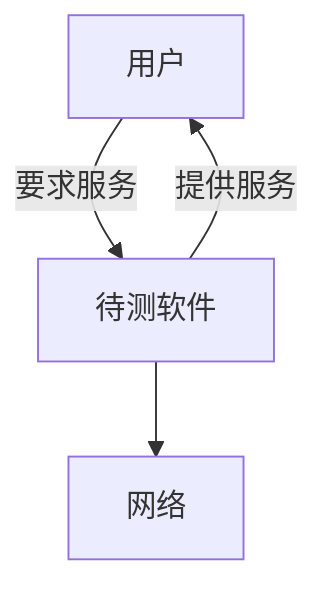
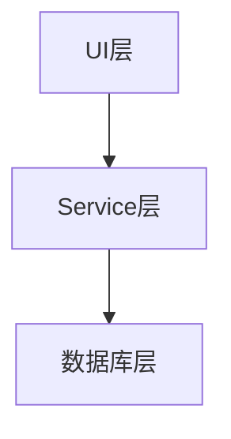

## 14 接口测试基础

### 14.10 认识接口测试

手工测试的模式：


### 14.20 网络协议

上一小节中介绍了接口测试中一些重要的定义，接下来我们要讨论学习接口测试过程中我们要关注的最重要的东西：网络分层和数据。而在此之前，需要先理解协议。

#### 什么是协议

网络协议定义了计算机之间通信的方式。我们来看一个类比：

上图左边是人类之间的”人类协议“。当我们按照这个协议向别人问时间时，我们先向其他人发送一个”你好“（这段数据我们称为一个”报文“），此时对方可能会回复一个”你好“。当对方这样回复了，我们就知道可以继续向他提问来问时间了。而如果对方给的回复是其它内容，比如”别烦我“或者干脆没有回复。那么我们就知道对方处于无法应答的状态，于是我们需要转向其他人问时间。

再看一个例子。比如你在上课的时候想要向老师提问，首先你举起了手（按照“上课提问”的协议<u>发送了一个报文</u>），然后老师面带微笑，对你说请讲（这是老师向你发送的一个<u>报文响应</u>，告诉你可以继续提问）。于是你继续提出了问题“请问xxx”（这是问题内容的**报文请求**），老师就会回答你（这又是一个**报文响应**）

这种 **询问和回答** 的交流方式，就是协议的核心，也就是 **请求和响应**。

右边是计算机网络协议。一台计算机按照网络协议里规定的请求和响应的格式去与另一台计算机通信。图中左侧的计算机向右侧请求建立TCP连接，然后通过HTTP请求获取特定的网页数据。现在的网络协议适用的不仅仅是普通计算机，其他像手机、平板、各种智能设备，凡是能上网的都适用于网络协议。

<u>**协议定义了通信实体间交换的报文格式和次序以及发送和接收报文的方式及处理动作。**</u>

### 14.30 网络分层和数据

上一小节中介绍了接口测试中一些必要重要的定义, 这一节我们来讨论一下在学习接口测试过程中我们要关注的最重要的东西: <u>**网络分层和数据**.</u>

首先我们来尝试理解一下, <u>为什么网络是要分层的?</u>

我们可以想象一个整个互联网,有无数的终端, 很多很多协议, 无数的交换机和路由器. 随着时代不断发展, 这张网络越来越大, 甚至你家的冰箱可能都能上网.

为了描述这样的超级复杂的系统, 计算机网络采用了分层的方法,来描述这种复杂性.

我们在日常生活中的一个类似的例子是: 乘飞机旅行

图: 略

这里,我们把在机场乘坐飞机旅行的过程按照分层的模式划分成5个层次

<u>对其中**任意一个层次**来说,它都**和它下面的层次**==一起提供了某种功能==</u>, 比如:

1. 在票务层及以下层次,提供了一个人和他的行李从一个机场柜台到另一个机场柜台的转移
2. 在行李层及以下层次, 提供了一个人和他的行李从一个机场的行李托运处到另一个机场的行李托运处的转移
3. 在登机口层及以下层次,提供了一个人和他的行李从一个机场的登机口到另一个机场的登机口到转移
4. 在起飞着陆层及以下层次, 提供了一个人和他的行李从一个机场的跑道到另一个机场的跑道到转移

上述四点也就是各层向它上面的层次提供的服务. 比如:

图: 略

这里值得注意的是, **<u>每一层本身都有一定的功能</u>**, 比如登机口层提供了登机和离机功能.

同时, **<u>每一层都使用它以下的所有层次提供的服务</u>**, 比如登机口层的功能是建立在起飞着陆层和飞行层提供的把人和行李从一个机场的跑道转移到另一个机场的跑道的服务之上的.

计算机网络也使用类似的分层方式来描述, 我们<u>只需要关注**各层次本身的==功能==**和**向上提供的==服务==**</u>, 就可以理解计算机网络这个复杂的系统.

以下是两种网络分层方法:


​																5层因特网协议栈


​															 7层ISO OSI参考模型

可以从5层因特网协议栈开始学习. 7层ISO标准的OSI参考模型是国际标准化组织试图对网络协议栈进行标准化的时候搞出来的东西. 我们大概知道他每一层对应原来的5层协议栈中的哪一层就好. 

说一下分层和接口测试的关系:

前面也说了,在分层模型描述下的复杂系统, 它的每个层次都会具备自己的功能, 以及向更上方的层次提供服务. 服务就是service, 而接口测试有的时候又叫服务测试. 比如web service 测试 — 网络服务测试. 换言之, 我们做**<u>接口测试, 其实测试的就是==待测软件提供的服务==</u>**. 而现在大多数待测软件是网络程序, 它使用了互联网各个层次的服务, 又在其上附加了自己的功能, 并提供给用户用.

因此, 我们可以这样来理解接口测试:



这里, 一个待测软件, 提供给用户用的很多很多接口就是我们接口测试要测试的服务.

同样的, 一个复杂的待测软件内部也可以有很多接口, 也可以分层次, 比如这样:



像这样, 一个待测软件里也分了很多层次, 这个图上是一个超级简单的3层结构. 那么这里数据库层提供了数据存储的服务, service层和它以下的层次一起提供了各种业务逻辑处理功能, 而UI层和它以下的层次一起提供了基于界面的业务逻辑处理功能.

到这里为止, 我们知道了更广义的接口测试, <u>在系统的各个层次上提供的服务, 都可以做接口测试.</u>

### 14.40 应用层和http协议

接下来我们来看一下5层网络模型下各个层次的作用和其中传输的数据.

应用层是网络应用程序和他们的应用层协议所在之处. 应用层有许多协议, 比如HTTP协议, SMTP协议和FTP协议等.

HTTP协议, 我们上网时在浏览器里输入的网址前的那个 http://就表示我们在用http协议请求和传送网页.

SMTP协议, 简单邮件传输协议, 在我们使用 Outlook 之类的邮件程序的时候就需要配置使用的电子邮件的SMTP服务器地址 (也有的邮件是用POP3协议的)

FTP协议, 内网上传下载文件, 常常使用FTP.

而应用层的网络应用程序，对测试人员来说，我们测试的绝大部分网站，app都是这种程序。比如搜索引擎，网上购物网站，论坛等等。

举例，一个搜索引擎网站，我们在浏览器里，使用HTTP协议向这个网站的服务器端发送了一个请求要求获取某个关键字的搜索结果。我们在页面里输入的内容，被按照HTTP协议封装成报文，发送到这个网站的服务器端，服务器端按照HTTP协议把报文里的数据部分提取出来，进行处理。

像这样，我们通过浏览器里封装报文，使用应用层的HTTP协议和应用层以下的层次提供的“把报文传送到服务器端”的服务来完成报文的传输，之后服务器端再把报文解开，提取出内容，然后把搜索结果用一样的流程返回到浏览器里。下图表示了这个过程：

```sequence
浏览器->服务器:使用HTTP协议发送
Note left of 浏览器: 封报文
Note right of 服务器: 解报文
服务器-->浏览器: 使用HTTP协议发送
Note right of 服务器: 封报文
Note left of 浏览器: 解报文
```

那么HTTP协议里又是怎样封报文和解报文的？

HTTP协议里是按照协议规定好的格式来封装报文和解报文的，比如这样：

| 请求行      | 方法 URL 版本，比如 GET http://www.baidu.com HTTP/1.1 |
| ----------- | ----------------------------------------------------- |
| Header 头部 | 字段名： 字段值                                       |
| Body 请求体 | 具体业务数据，比如一个json                            |

这是一个HTTP请求的三个组成部分：

请求行，包括了使用的HTTP方法（比如Post, Get,Delete等），请求的URL和协议版本。

请求头（header），包括了一些字段，这里可以放很多有业务意义的字段，比如用户名和密钥。也可以放一些很常见的通用的内容，比如日期，服务器软件名及版本，请求体长度等。

请求体（body），具体的业务数据，比如常见的restful风格的HTTP接口会在这个地方放一个json对象。

上面是发送的请求，下面是服务器给的响应：

| 状态行      | 版本 状态码 短语，比如 HTTP/1.1 404 NotFound |
| ----------- | -------------------------------------------- |
| Header头部  | 字段名：字段值                               |
| Body 请求体 | 具体业务数据，比如一个json                   |

这里唯一的不同是响应的第一行是状态行。

状态行里可以看到状态码和短语，一些常见的状态码和短语有：

200 OK，表示请求成功

301 Moved Permanently 表示所请求的内容已永久转移。这个响应的头部里会带上Location这个字段，包含新的网址。而客户端会自动再次向新网址发起请求。

400 Bad Request,表示发送的请求服务器无法理解，通常就是发送了错误的请求内容

404 Not Found，请求的资源找不到

500 Internal Server Error，服务器内部错误。

### 14.50 其他层次和协议

#### 其他层次

##### 传输层

传输层主要有TCP和UDP两个协议我们需要知道，这一层传输的是报文段。顾名思义，传输层的协议就是用来把应用层报文从一个端传送到另一个端。应用层的报文，比如HTTP报文，可以通过TCP或UDP来传输。

其区别是：

TCP协议是面向连接的服务，它能确保报文被传送到目的地，如果目的地没收到，会重新传。

UDP协议是无连接的服务，它不管三七二十一，只把报文发出去，不管到底有没有被目的地接收到。

以TCP为例，它也有自己的报文段格式，前面应用层的整个报文，作为它的报文段里的业务数据来传输。我们可以想象一个快递包裹，它里面装的是真实业务数据，然后从应用层开始，每一层都会在这个包裹外面再包一层包裹，并在包裹皮上写上这一层自己定义的一些数据。

扩展阅读：TCP的三次握手建立连接

了解TCP是如何通过三次握手建立连接的。搜索TCP的报文段组成格式，进一步了解TCP协议。

##### 网络层

网络层负责传输数据报，同样，数据报里的主要内容就是传输层的报文段。

网络层的主要协议是IP协议，其他还有一些路由选择协议。

##### 链路层

链路层传输的数据称为帧。链路层的例子包括以太网、WiFi、电缆接入网的DOCSIS协议等。

##### 物理层

物理层的作用是把链路层的帧，一个比特一个比特地从一个节点传输到另一个节点。物理层协议与链路层相关。

#### 其他协议

大部分应用层程序的接口测试是使用HTTP协议的，还有一些其他包括自定义的协议。比如Dubbo是阿里开源的一个高性能优秀的服务框架，它支持：dubbo,rmi,Hessian,Webservice,thrift,memcached,redis,http。

这里可以看到HTTP只是其中的一个协议，如果你的项目组使用Dubbo之类的支持多种协议的框架来做开发，那么你的接口测试也可能需要支持不同协议。虽然，这些协议看上去很多，很复杂，但是实际上，我们做接口测试的原理都是一样的，参考对HTTP接口的接口测试原理，不同协议的区别知识封报文的格式不同，或加了一些特殊限制，又或者是所基于的传输协议不同。

|   IP 头部 |    TCP 头部 | TCP数据（HTTP请求完整报文） |
| --------: | ----------: | --------------------------- |
|           |   *TCP协议* | *完整报文*                  |
|           |  **IP协议** | **的数据**                  |
| <u>IP</u> | <u>协议</u> | <u>完整报文</u>             |

在这张图里，我们看到一个IP协议的报文的数据部分包含了完整的TCP报文。而TCP协议的报文数据部分又包含了完整的HTTP报文。同样在这个HTTP报文的数据部分也可以再包含其他协议的完整报文，比如WebService协议报文。

对于这么多协议要怎么在接口测试的脚本中处理，我们按照以下原则来做：

1. 先找现成的实现了这个协议的第三方库
2. 没有第三方库时使用它的下一层的协议的库来自己实现一个库

举例：做一个内部自制协议的工具的测试开发，没有现成的库调用。因为这个协议是由TCP协议来传输的，我们就基于TCP协议的库来实现了一个这个协议的库。

相关搜索关键字：socket 套接字

### 14.60 使用requests访问豆瓣

例1：使用requests访问豆瓣电影的例子

```python
import requests
url = 'http://api.douban.com/v2/movie/top250'
r = requests.get(url,params={'start':1, 'count':25})
print(r)
res = r.json()
for movie in res['subjects']:
    print(movie['title'])
```

第3行使用requests库去get这个接口的内容，并且传了参数说从1开始取到25

这里传什么参数，用什么格式传参数，是由接口提供方定义的。

第4行打印了接口的返回值。

第5行把接口的返回值转换成了json对象。

第67行略

> 为什么print(r) 时只出现HTTP代码比如200？
>
> ​		编写这个类的时候可以通过定义`__repr__`函数来自定义会打印出来的内容。requests的作者定义了你打印一个响应时，显示的是HTTP code而不是body。但是响应里是有body的，所以你打断点看一下就会发现在`r.content`里的内容就是豆瓣返回的json响应。

### 14.70 requests构建HTTP请求

首先我们回顾一下, http协议的包结构:

| 请求行      | 方法 URL 版本, 比如 GET http://www.baidu.com HTTP/1.1 |
| ----------- | ----------------------------------------------------- |
| Header 头部 | 字段名: 字段值...                                     |
| Body 请求体 | 具体业务数据, 比如一个json                            |

#### 构建请求行

==请求行里我们需要输入的内容是: **方法名**和**URL**==

例1: 各种http 方法的调用例子:

```python
import requests

r = requests.get('https://api.github.com/events')
print(r.content)
r = requests.post('http://httpbin.org/post', data={'key': 'value'})
print(r.content)
r = requests.put('http://httpbin.org/put', data={'key': 'value'})
print(r.content)
r = requests.delete('http://httpbin.org/delete')
print(r.content)
r = requests.head('http://httpbin.org/get')
print(r.content)
r = requests.options('http://httpbin.org/get')
print(r.content)
```

<u>requests 库在引入后, 直接用“==requests.方法名==” 就可以发出对应方法的HTTP 请求. 而每个方法对应的参数, 第一个参数固定是请求头里的url, 之后的参数各有不同.</u>

这里只有get方法的一个参数是实际在请求行里生效的, 他会被添加到url 里, 其他的参数都是在请求体(body)或请求头(header)里生效.

例2: get 方法的 param 参数的例子:

```python
import requests

payload = {'key1': 'value1', 'key2': 'value2'}
r = requests.get('http://httpbin.org/get', params=payload)
print(r.url)
```

最后屏幕上会打出来 http://httpbin.org/get?key1=value1&key2=value2

这就是这个get请求发出来的真正的url.

我们也可以直接在URL参数里这样写:http://httpbin.org/get?key1=value1&key2=value2, 这样就不需要param 这个参数了. 实际工作中, 我们可以根据实际情况选择要不要用param参数.

#### 构建请求体

==请求体里我们需要输入的内容是: **body数据**.==

这个数据可能是json, 可能是字典, 也可能是别的数据类型比如一个字符串、一段XML, 现在最流行的数据类型可能就是json和字典.

在python中json是一种字符串, 它定义的内容就是“键值对”, 和字典很类似

例3: json 字符串和字典之间的类型转换, 这里用了json 这个标准库

```python
import json
dict_a = {"k1": "v1", "k2": "v2"}

# 把字典转成json字符串
x = json.dumps(dict_a)
print(x)
print(type(x))

# 把json字符串转成字典
y = json.loads(x)
print(y)
print(type(y))
```

请求体里的数据我们怎样在requests 的方法调用里输入:

通过例1里我们试过的requests提供的http方法来传入.

例1中 post 和 put 方法我们用的 data 参数是传递字典作为请求体数据. 此外, 还可以用 json 参数来传递 json 字符串作为请求体数据.

如何知道requests的每个方法都有哪些参数: ctrl+左键点进去看.

例4: requests 中对于 post 方法的定义:

```python
def post(url, data=None, json=None, **kwargs):
    r"""Sends a POST request.
    
    :param url: URL for the new :class:`Request` object.
    :param data: (optional) Dictionary, list of tuples, bytes, or file-like object to
    	send in the body of the :class:`Request`.
    :param json: (optional) json data to send in the body of the :class:`Request`.
    :param \*\*kwargs: Optional arguments that ``request`` takes.
    :return: :class:`Response <Response>` object
    :rtype: requests.Response
    """
    return request('post', url, data=data, json=json, **kwargs)
```

这里的 docstring 文档告诉我们, post 方法接受的参数有 url, data(可选), json(可选), 此外还接受`**kwargs`, 这个表示接受任意的requests支持的关键字参数, 但是文档上没写还有哪些关键字参数是requests支持的, 好在我们一般也不需要用到这个参数.

post 的两个可选参数 data 和 json 的区别:

1. 用data 参数时发送的data 是一个字典, 而json 则是一个字符串

2. 那么应该用 data 还是 json?

   看接口文档中的要求, 也可以通过抓包来分析, 或者两种都可以试试.

#### 构建请求头

请求头里我们可以输入的内容非常多.

例5: 看一个headers的例子

```python
import requests
r = requests.get('http://www.qq.com')
print(r.headers)
```

运行这段程序后我们可以看到qq 服务器给我们返回的响应里的header 内容.

可以看到这里包含了Date, Content-type, 编码信息、connection类型、服务器信息、超时时间等许多内容.

requests的headers是一个字典的子类`<class 'requests.structures.CaseInsensitiveDict’>`, 我们可以往里面放各种服务器端需要的key和value

例6: 往header请求里放数据的例子

```python
url = 'https://api.github.com/some/endpoint'
headers = {'user-agent': 'my-app/0.0.1'}
r = requests.get(url, headers=headers)
```

这里放了一个 user-agent, 值为my-app/0.01

有的接口里我们会在这里放 username 和 password, 或者 username 和 api_token(token 就是一个替代密码的令牌). 有时也会在header里存放一个 auth 字典, 里面包含了登录需要的用户名密码信息.

这一块内容较为复杂, 我们在实际工作中, 应该以接口文档或抓下来的包为准来构建自己的 http 请求. 也正因为实际工作中, 开发可以自己定义想要的请求头内容和请求体内容, 我们往往要求开发在提供文档的同时, 提供成功的请求和响应的例子, 以便用脚本来模拟这些请求.

### 14.80 requests中的响应

上一节里我们了解了怎样用 requests 库来构建和发送HTTP 请求， 这一节我们来了解下怎样解析服务器端给的响应。先回顾一下HTTP响应的包结构：

|   状态行    | 版本 状态码 短语， 比如 HTTP 1.1 404 NotFound |
| :---------: | :-------------------------------------------: |
| Header 头部 |               字段名： 字段值…                |
| Body 请求体 |          具体业务数据， 比如一个json          |

#### 在IDE 中打断点观察响应结构

这里来看一下调试器里显示的内容

r = {Response} 这个表示 r 是一个 Response 类的实例, Response 类是 requests 库里定义来表示响应的类

r._content 等以下划线开头的内部变量我们暂时不用管

`r.connection` 看上去存放了一些连接相关的内容, 我们一般也不用

==`r.content` 这个就是响应主体内容, 以字节 bytes 类型保存, 我们把它转换成字典或字符串后就是我们想要的**响应数据**==.

<u>`r.cookies` 这个保存了这个响应带的cookie, 一般也没什么用, 后面我们会用 requests 的会话来管理 cookie.</u>

`r.elapsed` 这个请求的响应时间.

`r.status_code` 这个就是HTTP 响应里的状态码, 非常重要, 常用于写断言

`r.reason` 这里会包含一个短语, 如果响应失败, 会告诉你失败原因

==`r.text` 响应数据转换成的文本==

`r.url` 这个响应来自于哪个url

#### 解析响应

例2: 解析一个响应

```python
import requests, json

r = requests.get('https://api.github.com/events')
print(r.content)

dict_json = json.loads(r.content)
print(dict_json)
```

在这个例子里, 我们用json 这个库解析了 github 给我们返回的响应数据.

通过打断点调试, 可以看到 `dict_json` 其实是一个列表, 列表元素是字典, 字典里包含了 github 的各种事件信息:

例3: 使用requests 库自带的 json 解析器解析响应

```python
import requests

r = requests.get('https://api.github.com/events')
print(r.json())
```

可以看到, 同样解析出了一个包含很多字典的列表. 一般建议用的是<u>例3的方式解析json数据, 比较方便. 当然有时候解析也会失败(比如服务器返回了一个格式错误的json), 那时就可以通过观察 `r.content` 和 `r.text` 等来分析原因.</u>

### 14.90 requests中的会话

之前的例子中，我们都是单独调用接口或解析响应，但在实际应用场景中，我们往往会需要连续调用一些接口。

比如：

1. 先登录
2. 再做一些操作
3. 最后登出

就像我们在浏览器中对网页做操作一样， requests 也可以模拟这些操作的步骤

在开始之前，我们简单了解下浏览器是怎样做到这些事情的, 为什么我们在浏览器里登录了某个网站后, 这个网站就知道我们后续的操作都是在这个刚刚登录的账号里做的呢?

#### cookies和session

这里有两个概念, 一个是cookies, 一个是session

Cookie 或者 Cookies 是Web 服务器**保存在用户浏览器**上的小文本文件. 它可以包含有关用户的信息, 比如用户名、甚至加密后的密码之类的信息. 这样, 当我们再次使用这个浏览器访问这个服务器时, 服务器可以直接读取这些信息, 而无需用户再次输入.

Session, 称为会话, 用户通常会在服务器提供的网页之间进行跳转来访问不同的页面, 服务器对一个用户创建一个session 对象, **存放在服务器端**, 这样服务器就知道这个用户是谁了. session 里也可以存放用户名等信息.

Session 一般是==会过期自动终止==的, 毕竟服务器端资源有限, 一段时间不操作, 很多网站就会自动删除你的session, 这时你再做操作, 网站会提示你重新登录. 而有些网站在提示你重新登录时, 页面上还会显示“欢迎, 某某某”这样的滋养, 因为这后面的用户名它很可能是存在了你的浏览器cookies 里, 所以你重新操作时, 网页还是知道你的用户名, 毕竟==cookies 是不会自动被删除的==, 顺带一提, <u>cookies 是保存在客户端, 所以我们是可以设置要不要保存cookies的</u>, 很多网站都设置了如果不保存cookies 将提示你无法使用该网站.

#### requests中的cookies

在 requests 中, 响应和请求里都有 cookies 功能.

如果某个响应中包含一些cookie, 你可以快速访问他们:

```python
>>> url = "http://example.com/some/cookie/setting/url"
>>> r = requests.get(url)
>>> r.cookies['example_cookie_name']
'example_cookie_value'
```

要想发送你的cookies到服务器, 可以使用 cookies 参数:

```python
>>> url = "http://httpbin.org/cookies"
>>> cookies = dict(cookies_are='working')
>>> r = requests.get(url, cookies=cookies)
>>> r.text
'{"cookies": {"cookies_are": "working"}}'
```

Cookie 的返回对象为 RequestsCookieJar, 它的行为和字典类似, 但接口更为完整, 适合跨域名跨路径使用.

你还可以把 Cookie Jar 传到 Requests 中:

```python
>>> jar = requests.cookies.RequestsCookieJar()
>>> jar.set('tasty_cookie', 'yum', domain='httpbin.org', path='/cookies')
>>> jar.set('gross_cookie', 'blench', domain='httpbin.org', path='/elsewhere')
>>> url = 'http://httpbin.org/cookies'
>>> r = requests.get(url, cookies=jar)
>>> r.text
'{"cookies": {"tasty_cookie": "yum"}}'
```

#### requests中的会话

在 requests 中, 也有回话的概念, 这里只是借用了session 这个名词, 但其实, 和服务端的session 并不同. requests 是模拟客户端的工具, 显然不可能用它来模拟服务端的会话. 但是, 我们也不想像上面的cookies 例子一样, 去手动在一系列请求和响应之间传递cookies

The Session object allows you to persist certain parameters across requests. It also persists cookies across all requests made from the Session instance, and will use urllib3’ s <u>connection pooling</u>. So if you’re making several requests to the same host, the underlying TCP connection will be reused, which can result in a significant performance increase.

A Session object has all the methods of the main Requests API.

requests 的 session 就帮助我们把这变成了自动的

例1: requests 中会话的例子

```python
import requests

s = requests.Session()
r = s.get('http://httpbin.org/cookies/set/sessioncookie/123456789')
r = s.get("http://httpbin.org/cookies")
print(r.text)
```

这个例子中:

第二行创建了一个requests 会话,

第三行使用 get 访问了一个网址, <u>**这个get 请求服务端创建了一个服务端的session 对象, 并且这个网址的作用是把服务端的 session 内容返回给用户.**</u>

第四行用户 get 了 另一个网址, 服务器返回了一个 `"sessioncookie": "123456789"` 的 json 数据. 这个数据恰恰是第三行的返回值, 这说明服务端正确地记住了我们.

==requests的session还有一部分没有写完==

## 15 测试执行器

### 15.10 初识测试执行器


### 15.20 测试执行器相关基础


### 15.30 使用unittest


### 15.40 使用pytest (1)


### 15.50 使用pytest (2)


## 16 接口测试框架搭建

### 16.07 接口测试的测试理论

#### 软件测试的基本问题

在一个典型的测试项目中, 我们拿到一个软件系统, 要做测试. 这个系统有可能有文档, 也有可能没有. 有时候, 即使有文档也可能不完整或没有及时更新. 当拿到这个测试任务时, 我们首先要考虑以下基本问题:

1. 为什么要对这个系统进行测试, 你想在测试中发现什么? (测试==目标==问题)
2. 如何组织你的工作以实现你的目标? (测试==策略==问题)
3. 怎样知道系统在测试中最终是pass还是fail?(测试==依据==问题)
4. 如何对这个系统进行穷尽的测试?(测试的==无穷性==问题)
5. 不能做穷尽的测试, 那么要测多少才够? (测试==完整性==度量问题)

#### 软件测试的目标

软件测试可能的目标有很多, 以下是一些软件测试可能的目标:

* 找到重要的bug, 使他们得到修复
* 评估产品的质量
* 对是否发布产品的决策提供帮助
* 组织不成熟的产品被发布
* 对预测和控制产品的支持成本提供帮助
* 监测待测产品和其他产品的交互性
* 解释如何安全地使用产品
* 评估产品与实际需求的一致性
* 证明产品符合某个特定的标准(如国际标准, 国家标准等)
* 确保测试的过程符合问责制标准
* 减少产品可能引起的安全方面的诉讼风险
* 帮助客户提高产品的质量和可测试性
* 帮助客户改进他们的流程
* 作为第三方检测产品

注意, 我们在做实际项目时, 每个项目的目标都要自行根据实际情况分析, 并且在分析后, 排列各个目标的优先级. <u>这些**目标**和他们的**优先级**决定了我们的**测试策略**</u>. 测试策略的意思就是指如何实现测试目标. 而==接口测试, 正是测试策略的一种==. <u>并不是任何项目都需要做接口测试</u>, 当我们的项目有以下目标时, 往往考虑使用接口测试:

* 要快速验证功能的正确性并需要反复迭代
* 要验证基于**软件即服务**的架构开发的项目

前者，基本适用于现代的大多数项目，目前业内大多数项目采用**<u>迭代开发</u>**模式，并且往往每个迭代的时间都很紧张。<u>测试过的功能又需要**反复做回归测试**</u>。那么<u>为了*快速的回归测试*， 我们往往会决定进行接口测试。</u>同时，再辅以一些其他测试策略，比如手工测试或基于图形界面的自动化测试。具体来说，我们可以这样安排，<u>在软件的第一个迭代期内，通过手工测试快速确保这个迭代的功能。同时挤出时间对其中部分功能做接口测试自动化的脚本编写。并在下个迭代中使用这些脚本做回归测试。然后每个迭代都增加新的自动化脚本并维护原有的脚本，逐步形成一个完整的测试用例集。</u>

后者，当待测软件使用诸如SOA、微服务等理念或架构开发时，可能一个大项目分为几个小模块，其中<u>有些模块的产物就是一些接口</u>。那么对这些模块测试时，也会做接口测试。

另外，我们还要考虑什么情况下不用做接口测试：

* 当待测软件的主要功能均在客户端完成时，比如单机软件、单机游戏等。此时不涉及接口测试。
* 当待测软件用到的服务均由第三方提供时，比如测试一些第三方气象软件。气象数据的服务往往由气象台发布。此时即使做了接口测试也是与待测软件无关的。

值得注意的是，现在大多数软件都不是单机软件，因此大多数项目都需要做接口测试。但在软件测试行业中，确实存在一些小众领域，可能是用不到接口测试的。比如：门店软件测试、POS机软件测试、车载软件测试、设计工具软件测试等等。在选择工作岗位时，我们需要注意，小众意味着跳槽困难。建议新人尽量做一些大众点的岗位。此外，也有一些软件虽然需要接口测试，但招专人去做，因此这些软件也会招专人去做不需要测接口的客户端软件测试岗位。这种模式在很多手机app项目里存在。

#### 接口测试的策略

当我们基于项目的实际情况分析, 决定要做接口测试时, 就要考虑接口测试的策略, 也就是怎样做接口测试. 常见的做法有以下三种:

* 使用jmeter, postman, soapUI 等基于图形界面的工具去做
* 使用编程语言编写的自动化测试平台来做
* 使用编程语言编写接口测试框架加上脚本来做

这三种策略各有优势.

其中, 使用基于图形界面的工具去做, 好处主要是对测试人员要求低和上手速度快. 但缺点是可维护性差. 因为要求低, 如果选用这种策略, 可以尽量用较低的薪酬去招人, 压低项目成本.

而使用自动化测试平台来做则成本较高, 出成果较慢. 这种做法对测试人员的技术水平上最高的. 因此需要付出较高的薪酬. 当然, 如果在大厂, 不计成本去做的话, 使用自动化测试平台来做是很好的做法.

最后是使用接口测试框架加脚本来做.这种做法对测试人员的技术要求适中, 相信通过对本书的学习, 大家都可以达到这个要求. 这个做法的核心在于其使用的接口测试框架. 本书中给的框架就可以作为一个接口测试框架的模版, 根据实际情况, 大家对这个框架做修改, 来适应自己的项目即可.

选定接口测试的主要策略之后, 要做的事根据实际项目要求来决定具体的策略细节. 比如, 笔者曾经做过一个广告接口的项目, 全部都是单个接口调用. 那么测试时,也只要对单个接口做调用即可.而另一个在线电影网站的项目中, 我们的接口不但要单独调用作测试, 还需要模拟用户场景做一些接口的串联调用.也就是用第一个接口的返回数据里的一些值作为第二个接口的输入参数.这样来模拟一些用户场景. 一个复杂的场景可能要调用十几个接口. 那么这里简单分一下:

* 对单个接口的测试
* 对多个接口库串联成的场景的测试

#### 接口测试的依据

什么是测试的依据呢，<u>测试的依据就是指我们来**判断一个问题是不是bug的依据**。同时，也指我们**判断一个迭代的测试有没有通过的依据**。</u>

先说判断一个问题是不是bug的依据。作为测试人员，我们不仅仅是把所有问题都报上去就完事了。二是要对报上的问题做一些分析的。其中分析这个问题算不算bug，需不需要修复，就是最重要的分析了。在这个问题需要修复的前提下，再去分析bug的出现原因才是有意义的。

比如，在做接口测试时，当我们遇到接口返回值为200，是不是就表示这个接口调用成功了? 当接口返回一个表示错误的值，而没有给出错误的原因时，这个接口还正常吗？这都需要用<u>测试依据的思维</u>来分析，才能给出结论。

首先，<u>第一个依据是**接口文档**</u>。如果有详尽的接口文档，那么这些问题都可以迎刃而解。但是，实际项目中，可以说我们从未见过真正详尽的文档，即使有文档，往往也不全。因此，我们必须要具体问题具体分析。

<u>第一个原则是**分析问题对用户的严重程度**</u>。举个例子，有一个培训班的选课系统，在用户选择课程后，接口报错说失败，但接口返回值里没有给出失败原因。这算bug吗？选择失败的原因可能有：网络错误、课程人数已满、服务器内部出错等等。但用户不一定关心这个原因。用户可能只要知道选课成功还是失败就行了，那么在这种情况下，这个问题可以不算bug，或者把它认为是一个优先级很低的bug。而假如用户必须知道失败原因才能决定要不要再次选课，那这个原因缺失就是bug了。

<u>第二个原则是**看有谁关心这个问题**</u>。举个例子，有一个订单系统，新增数据时，只会返回success，而不返回这一条新增的数据的内容。这算bug吗？通常来说，没有这个返回数据，对功能并不影响，可以不算bug。但假如这个功能对性能测试人员来说很有必要的话，那也可以把它当做bug提出来要求开发把数据加到返回值里。同样，有些问题可能用户不关心，但别的模块的开发关心，又或者产品经理关心，这种情况下也可以判定为是一个需要修复的bug。

另外重要的原则还有：<u>**看有没有安全风险**</u>，比如会不会导致用户信息泄露或者出现安全漏洞。

再者就是判断一个迭代的测试有没有通过的依据。

对此, 我们要记住的是, <u>测试是为项目服务的</u>,而不是反过来项目为测试服务. 所以测试人员通常不会说一个项目质量太差不能发布, 而是<u>把当前质量状态下发布会产生的风险提示给项目相关人员.</u> 具体风险可以是有多少严重程度为什么等级的bug, 有没有必须修复的严重问题仍未修复.

原则上讲, 如果有严重问题是不能发布的, 但如果拍板的经理或者整个团队都认为可以在这个风险下发布, 那么一般还是会发布的. 此种情况下, 我们可以重新评估这个问题的严重程度, 看是不是可以降低一下. 也就是说测试的依据并不是死板的, 而是随时根据项目实际情况可以调整的.

#### 接口测试无穷性和测试用例设计

软件测试是不可穷尽的. 对同一个软件, 可以设计无数的测试. 那么对于接口测试来说, 显而易见, 接口测试也是不可穷尽的. 对一个接口, 可能可以设计无数组传入参数, 那么如何来设计? 这里, 我们的原则是要用**<u>黑盒与白盒相结合, 也就是灰盒的方法来设计测试用例.</u>** 首先是<u>测试用例**设计依据**:</u>

* *<u>接口文档优先</u>*
* *<u>如果没有文档, 以抓包结果作为测试用例设计依据</u>*

通过阅读文档或抓包, 我们可以知道这个接口有哪些<u>传入参数</u>和<u>返回参数</u>. 但是对于参数的意义, 我们需要结合业务以及与开发、产品沟通来做了解

<u>设计接口测试用例的一般**步骤**</u>如下:

:fist_oncoming: 设计<u>传入参数</u>和<u>**预期**的返回参数</u>

:two_hearts:  使用发包工具或脚本<u>**调用接口**, 如果调不通,需要跟开发沟通</u>

:thought_balloon: 如果<u>调通了</u>,则<u>作为一个接口调用的**基础用例**</u>

:four_leaf_clover: 在基础用例上做扩充, 使用<u>黑盒的**等价类划分**</u>等方法<u>设计传入参数</u>. 形成<u>**单个接口的一组用例**</u>. 有时候我们要用到白盒的方法, 去阅读代码.比如当我们需要对接口做数据校验时, 需要读代码(或者问开发)才能知道要查数据库的哪个表

:fire: 在针对待测接口都设计好了基础用例的前提下, 组合各个接口,来<u>设计多个接口串联调用的**场景测试用例**</u>

这里要注意,<u>有的项目可能**不需要做场景测试**,也有的项目可能**不需要做单个接口测试**,直接做场景测试即可. 这要根据实际项目来决定.</u> 除了这些以外, **接口测试特有的测试场景**也要注意:

1. 接口测试一定有返回值，而且这个<u>返回值可能有多种**错误代码**，这些错误代码可以**覆盖**一下</u>
2. 接口测试的<u>**鉴权机制**是特有的，需要**单独测试**</u>。常见的鉴权机制有：在请求头里包含token、在请求头里的cookie里包含token等
3. 在**不同网络情况**下的测试，根据实际情况决定是否需要做。比如用户会不会在弱网下调用这些接口。

### 16.10 接口测试框架设计

首先我们来讨论一下接口测试框架的组成部分, 请看下图, 这是一个简单的自动化测试框架, 在单机上运行时的过程:


首先测试人员:one:<u>启动了测试执行器</u>, :two:<u>测试执行器调用了测试套件</u>(==<u>测试套件指**测试用例的集合**</u>==), 然后:three:<u>按照测试用例中描述的业务逻辑, 使用测试驱动库(如selenium, requests等) 去操作待测软件,</u> 并:four:<u>从待测软件中收集业务逻辑的执行结果. 将结果汇总之后, 生成测试报告.</u>

这就是一个最简单的测试框架的设计思路. <u>我们把**测试驱动库**, **测试执行器**以及**测试套件**们看作一个整体, 称为==测试框架==</u>. 要设计一个测试框架, 就要对这些组件分别进行需求分析和选型. 需求分析指的是我们把我们想要在这个程序里包含的功能点罗列出来.选型则是根据这些需求, 选择我们实现这些需求的方法, 这些方法可能是自己写代码实现, 也可能是使用第三方库实现

下面分别对各个组件进行需求分析和选型:

#### 1. 测试执行器

需求分析:

1. 可以调用测试用例, 并汇总成报告
2. 对失败的测试用例, 可以给出失败的原因
3. 对单个测试用例, 可以有前置操作或后置操作, 也就是支持俗称的setup和teardown
4. 可以按照需要执行选定的部分测试用例, 比如, 执行所有属于冒烟测试的测试用例.
5. 安装简单

选型: pytest

#### 2. 测试驱动库

需求分析:

1. 能发 HTTP 协议的接口请求

选型: requests

#### 3. 测试数据管理

暂时不需要

选型: 暂无, 前期测试数据将保存在文本文件里, 后期会单独讲.

#### 4. 测试报告

需求分析:

1. 要打出XML 报告和 HTML 报告
2. XML 报告应该和junit 兼容

选型: pytest-html

综上, 这个接口测试框架将基于 python+requests+pytest 来实现

### 16.20 接口测试框架设计2

首先我们把这个项目划分为两个子项目: TUGithubAPI 和 TUGithubAPITest

为什么这样划分?

这里我借鉴了python的rf 测试框架的设计理念: **关键字**和**脚本**.


一个网站的后台 HTTP 接口可能包括了很多很多方法,

第一步, <u>我们**把它封装成一个python类**</u>库. 回顾前面的教程, 我们曾经使用很多Py的标准库和一些第三方库. <u>我们设计一个接口测试框架的时候, ==目的是**能调用这个网站提供的HTTP接口**==</u>, 那么怎样调用呢? 自然而然地, 我们就想到, 可以把这些http接口封装成普通的py库.

这也是软件测试开发中的第一大核心方法: **封装**

请牢记封装的概念:

封装可以把不好用的东西改成好用的.

封装可以把别人的东西改成自己的.

封装可以往别人现有的东西上加你想要的功能

封装可以<u>改变程序的运行和调用方式, HTTP接口可以封装成py接口, 反过来py接口也可以封装成HTTP接口.</u> 

<u>我们的框架计划是**把GitHub提供的==HTTP接口封装成py类库==**. 这个库名为**TUGithubAPI**.</u>

当这个封装完成后, 就像使用普通py库一样, 我们可以<u>以**类名加方法名**的形式**来调用http接口**</u>. 假设有一个测试用例, 我们要登录github, 然后创建一个新的repo, 之后在这个repo里创建一个文件. 那么可能是这样的:

例1: 一个测试用例的伪代码示意:

```python
def test_create_repo_and_upload_file():
    github = Github(xxx).login(username=xxx, password=xxx)
    repo = github.create_repo(xxx)
    result = repo.upload_file(xxx)
    assert result.success=True,xxxx
```

而<u>这样的**测试用例集合**就会存放在另一个项目中: **TUGithubAPITest**</u>

两个项目的关系是这样的:


TUGithubAPI 是真正调用 Github 提供的 HTTP 接口的库.

因此, 如果只有 TUGithubAPI, 也可以用来在Github上做一些操作. 后面, 我们的项目也会从这个子项目开始写起.

再回到 <u>关键字</u> 和 <u>脚本</u> 的概念上来.

当我们在 TUGithubAPI 中把待测软件提供的**接口**封装成py方法后, **这些==py方法==其实就是rf中==关键字==**的概念. 而我们在TUGithubAPITest 中==调用这些**关键字**, **组成**一个又一个**测试用例**==, 这就是rf中的==测试**脚本**==的概念.


所以我们这个框架里吸收借鉴了rf的关键字和脚本的理念, 但又没有真正去用rf做测试执行器. 上一小节中, 我们选型测试执行器的时候选择了pytest, 原因是 它用起来比rf简单. 而当你真正掌握这个测试框架的抽象思想之后, 你可以替换其他工具选型.

拓展: <u>自动化脚本并不是一定要用来做测试, 还可以用来做自动化部署, 自动化运维等.</u> 事实上在运维领域里, 也有很多出色的自动化工具, 应用了自动化的思想, 比如 ansible.

### 16.30 项目开始前的准备

1. 预先装好一个趁手的编程IDE

2. 预先安装好Git

	之后本教程中，将以命令行形式使用git 命令来对我们托管在Github上的代码仓库做操作。每一小节新增的代码，都会放在项目仓库的教学用分支上。

3. 理解我们项目使用的git 分支模型和项目管理方式

  首先是Git 分支模型：

  **master分支**：<u>主分支，我们将在主分支上做release， 也就是发版本</u>

  **release分支**：<u>存放即将要发布到主分支的代码</u>，进release分支的代码必须是经过测试且可用的。同一时间可以有多个release分支。<u>**但项目初期我们将只使用一个release分支。后期则会改为多个分支交替发布。**</u>

  **integration分支**：<u>集成分支。项目成员提交的代码在集成分支进行集成。</u>

  **dev分支**：<u>**个人开发分支**，项目成员个人可以创建并使用的分支</u>

  <u>hotfix分支</u>：用来快速修复bug的分支

  <u>teach分支</u>：本项目特有的教学分支，在项目第一阶段中，每一小节的教程代码都会创建一个教学分支，方便大家直接下载源码进行学习。


每个分支都从上一个里拉出来，然后最终合入回这个分支。 Master里会依次拉出各个版本的release分支。<u>当人力充足时，甚至可以同时并行拉出多个release 分支。</u>

<u>*问题：这里也不是很懂，为什么可以拉出多个release分支，是从同一个节点拉出多个release分支还是从不同节点拉出release分支？*</u>

其他分支都会消失，而master分支永远延续。（有些项目中release分支会独立维护下去）

4. 本项目作为开源项目的特殊管理模式：

本项目的项目成员==需要fork我们的主项目到自己的个人账号下的仓库中，从integration 分支拉出dev分支，再通过发起pull request 来把自己开发的代码提交到主代码仓库的 integration 分支==。


<u>这里有个小问题：难道不应该是先合并到自己的Integration分支，然后再从自己的Integration分支发起PR到主代码仓库的Integration分支吗？</u>  update自问自答：不需要合并到自己的integration分支，因为自己的integration分支永远是落后于主代码仓库的integration分支的，就算是合并到自己的integration分支，往主代码仓库合并的时候还是要处理冲突。

<u>update 的思考：因为integration分支肯定不止一个人拉出dev分支，每个人提交PR的时间肯定也不一样，所以主代码仓库的integration分支一直在变化，那么当PR到主仓库的integration分支时，怎样来处理冲突呢？是由审核的人来处理吗？还是要自己先拉出来最新的integration分支，自己先处理冲突，然后再提交PR？</u>

为了让大家都能有练习的机会，到时候会根据项目活跃程度，来<u>**拉出不同数量的integration分支**</u>供大家练习。

<u>问题：为什么要拉出不同数量的integration分支？自问自答：怕人太多在同一个integration分支上，合并代码的时候不好合并？比如100个人都在同一个integration分支上</u>

### 16.35 代码的下载和提交

怎样把一个github仓库的代码下载到本地，并修改和提交？

1. 复制下载链接

2. 在本地执行`git clone`

3. 默认克隆的是master分支，使用`git checkout` 切换分支

	使用 `git branch` 查看当前分支，使用 `git branch -a` 查看当前一共有哪些分支

4. 还可以用`git fetch` 来拉取新增的分支

### 16.40 Rest请求客户端

> Rest含义以及和Restful的区别:
>
> * https://blog.csdn.net/wnx_52055/article/details/82178231
> * https://cloud.tencent.com/developer/ask/27329
> * https://www.zhihu.com/question/28557115
> * https://stackoverflow.com/questions/1568834/whats-the-difference-between-rest-restful

需要写一个rest请求的客户端，命名为`RestClient`, <u>这个类用于==收发我们将要用到的http请求==</u>。

假如我们不用这个类，收发请求一般是直接用requests来做。

例1. requests 收发请求的示例：

```python
response = requests.post("http://httpbin.org/post", data={"a":"b"})
print(response.text)
```

但这样发送的请求之间没有关联，当我们需要做一些==连续调用的请求==，比如“先登录再把商品加入购物车”的时候，==需要使用requests的session功能==。

例2: requests session 收发请求的伪代码示例:

```python
session = requests.session()

# 这个是伪代码, 不能运行.这一行表示登录
resp = session.post("http://wwww/", data={'username': "aaa", "password": "1111"})
print(resp.text)

# 这一行表示将商品加入购物车
resp = session.post("http://www", data={"xxx": "xxx"})
print(resp.text)
```

**由于登录和登录后的请求都是由同一个 requests session 对象来发出，两个请求里带了同样的 header 信息，包括里面的 cookie 信息，因此可以模拟用户在浏览器上先登录再xxx的操作。**

一般来说使用session足够用了，但是我们可以再优化一下，加入：**<u>给一个网站加一个默认的URL地址前缀</u>** 这个功能

比如我们的测试都是针对 github.com 这个网站来做的，那么按脚本2的写法，我们每个请求里都要写一遍完整的url，“http://github.com/login”, “http://github.com/xxxx”, 这使代码显得有些冗余。因此我们可以建一个类，自动给所有url加上前缀

例3: 增加了代码前缀功能的 RestClient 类

```python
import requests, json

class RestClient:
    
    def __init__(self, api_root_url):
        self.api_root_url = api_root_url
        self.session = requests.session()
        
    def get(self, url, **kwargs):
        return self.request(url, "get", **kwargs)
    
    def post(self, url, data=None, json=None, **kwargs):
        return self.request(url, "post", data, json, **kwargs)
    
    def options(self, url, **kwargs):
        return self.request(url, "options", **kwargs)
    
    def head(self, url, **kwargs):
        return self.request(url, "head", **kwargs)
    
    def put(self, url, data=None, **kwargs):
        return self.request(url, "put", data, **kwargs)
    
    def patch(self, url, data=None, **kwargs):
        return self.request(url, "patch", data, **kwargs)
    
    def delele(self, url, **kwargs):
        return self.request(url, "delete", **kwargs)
    
    def request(self, url, method_name, data=None, json=None, **kwargs):
        url = self.api_root_url + url
        if method_name == "get":
            return self.session.get(url, **kwargs)
    	if method_name == "post":
            return self.session.post(url, data, json, **kwargs)
        if method_name == "options":
            return self.session.options(url, **kwargs)
        if method_name == "head":
            return self.session.head(url, **kwargs)
        if method_name == "put":
            return self.session.put(url, data, **kwargs)
        if method_name == "patch":
            return self.session.patch(url, data, **kwargs)
        if method_name == "delete":
            return self.session.delete(url, **kwargs)
```

这里，这个类加了一些方法， 包括：

1. `__init__`方法： 初始化这个类，初始化的时候需要输入`api_root_url`, 也就是URL的前缀。另外在初始化时创建了`self.session` 用于保存 requests 的 session.
2. get, post 等各种 HTTP方法， 用于让用户使用，但==**这里并没有真正实现这些方法**==。 因为这些方法都是在requests 里有实现过，我们只要把参数传给requests就行了。这个传递我们写在request方法里，所以这里的HTTP方法都是调用requests方法。
3. `request` 方法： 真正调用`self.session`的各种方法，这里同样是把参数传下去，只是<u>在传之前，给所有用户的输入的 url 加了一个前缀</u>。前缀的值是用户在init方法里输入的。

例4：运行例3的类的代码：

```python
r = RestClient("http://httpbin.org")
x = r.post("/post", json={"a": "b"}
print(x.text)
```

这个例子介绍了怎样使用例3的 RestClient 向 http://httpbin.org/post 这个url post一个 json 对象，并打印了其返回值。所以我们看到了，一旦 RestClient 这个类被实例化后，我们发请求不需要再输入完整的url，这将使未来的测试脚本代码得到重大简化。

任务1: 通过网络搜索,了解 RestClient 类里出现的各种 HTTP 方法的含义及区别. 包括 get, post, options, head, put, patch, delete 这些.

1. [HTTP 请求方法](https://developer.mozilla.org/zh-CN/docs/Web/HTTP/Methods)

   先只捡重要的写:

   head: 请求一个与get请求的响应相同的响应, 但没有响应体

   put: 用请求有效载荷替换目标资源的所有当前表示

   delete: 删除指定的资源

   options: 用于描述资源的通信选项

   patch: 用于对资源应用部分修改

2. [说说RESTFUL中的方法](https://mingjia-vip.github.io/2018/03/13/%E8%AF%B4%E8%AF%B4RESTFUL%E4%B8%AD%E7%9A%84%E6%96%B9%E6%B3%95%EF%BC%9AGET%E3%80%81POST%E3%80%81PUT%E3%80%81PATCH%E3%80%81DELETE%E3%80%81OPTIONS%E3%80%81HEAD%E3%80%81TRACE/)

3. [菜鸟教程-HTTP 请求方法](runoob.com/http/http-methods.html)

任务2: 仿照例4, 写一段脚本, 使用 RestClient 向 gitihub.com 的首页发送 get请求

```python
github = RestClient("https://github.com")
resp = github.get("")  # "/" 也可以
print(resp.status_code)
print(resp.request.url)
```

问题: 为什么这里可以暴露出`status_code`这个接口?

自问自答: 这里对github http接口的请求方式做了处理, 但其实并没有对返回结果做处理, 也就是说, 从get一层一层调用,最终调用到 `self.session.get(…)` 这个返回的结果是requests的一个Response对象, 所以自然有status_code这个API了.

### 16.50 通过接口登录GitHub

上一次，我们新建了 `core/rest_client.py`这个文件，并且可以使用其中的RestClient 类来收发http请求，这一小节，我们接着上次的rest 请求客户端，向其中增加登录GitHub的功能。

#### 通过API 登录 Github

官网介绍了 Github API支持的登录方式：

1. 用户名密码登录。最直接的方式，向服务端发送用户名密码来登录。此外，特定的一些api只能用这个方式登录。
2. token登录。最常用的方式，使用一个特殊字符串token来代替用户名密码，完成用户登录权限验证
3. SAML登录。企业级里常用的方式，可以和企业里其他用户认证方式结合。
4. two_factor 登录。要求二次鉴权的登录方式，比如手机验证码登录。

在本教程中，我们将实现用户名密码登录和token登录两种方式。

例1. 用户名密码登录和token登录的实现

```python
class RestClient:
    def __init__(self, api_root_url, username=None, password=None, token=None):
        self.api_root_url = api_root_url
        self.session = requests.session()
        if username and password:
            self.session.auth=(username, password)
        if token:
            self.session.headers['Authorization'] = "token {}".format(token)
```

这里, 通过修改 RestClient 类的初始化方法, 添加了三个参数, username, password和token. 当 username 和password 不为空时使用用户名密码登录, 向 requests session 中添加auth 信息. 当 token不为空时使用token 登录, 向requests session 的headers里的Authorization 字段添加token信息.

#### 目录结构

接下来我们要封装一个Github接口, 来看看登录效果. 在封装这个接口之前, 我们来看看目录结构:


如图所示, 在TUGithubAPI 工程目录下, 我们新建了两个目录, 分别是API和core, core里存放核心的工具类RestClient, API里则会存放封装好的接口类. 而这两个目录外面还有一个`github.py`, 这个文件将作为总入口, 提供给这个代码库的用户使用.

今天我们要用的repos 接口是从github 文档的这里查到的:https://developer.github.com/v3/repos/

这里我们注意到有很多页面都挂在 Repositories下面. 这些都是我们后续要实现的. 现在我们的目录结构中, 只有`api/repositories/repos.py`, 后面就会有其他, 比如`branches.py`. 其他接口放在其他目录下. 

除了这些简单接口的封装, 存放在API 目录下外, 我们还会实现更业务化的连续操作, 比如通过调用若干个接口实现一个完整功能, 这种我们将来会在API目录同级别的地方建立domain目录, 来存放这类用户操作.

在这个小节中, 我们只是简单封装一下repos的一个接口, 来看看登录前后调用接口的区别, 下一小节才会正式封装这个接口.

#### 封装第一个Github接口

例2. `api/repositories/repos.py`

```python
from core.rest_client import RestClient

class Repos(RestClient):
    def __init__(self, api_root_url, **kwargs):
        super(Repos, self).__init__(api_root_url, **kwargs)
        
    def list_your_repos(self):
        return self.get("/user/repos")
```

例3. `github.py`

```python
from api.repositories.repos import Repos

class Github:
    def __init__(self, **kwargs):
        self.api_root_url = "http://api.github.com"
        self.repos = Repos(self.api_root_url, **kwargs)
        
        
if __name__ == "__main__":
    r = Github(token="xxxx")
    x = r.repos.list_your_repos()
    print(x.text)
    
    r = Github(username="xxxx", password="xxxx")
    x = r.repos.list_your_repos()
    print(x.text)
```

例2中, 我们又建立了一个新的类Repos, Repos是 RestClient 的一个子类

值得注意的是, 它的初始化方法有着和父类不一样的参数表(注意子类和父类的初始化方法可以接受不同的参数表):

```python
def __init__(self, api_root_url, **kwargs)
```

它接受了一个固定参数 api_root_url, 和一个关键字参数 `**kwargs`

固定参数大家很好理解, 而关键字参数的意思是, 可以传入任意的键值对作为参数. 当然, 观察父类的代码我们就知道, 这里虽然可以传任意的关键字参数, 但只有 username, password, token 这三个参数会被处理. 这里的关键是: ==Repos 作为一个子类, 它不需要知道哪些参数会被处理以及会被怎样处理, 它就直接在自己的初始化方法里调用了父类的初始化方法, 不论用户传入了几个参数, 它都原封不动传给它的父类==.

```python
super(Repos, self).__init__(api_root_url, **kwargs)
```

这里的super就是表示父类, 这一行调用父类的`__init__`方法.

初始化完成后, 自然就可以在子类中使用self来直接使用父类的方法了, 比如get 方法.

```python
def list_your_repos(self):
    return self.get("/user/repos")
```

我们先通过浏览器访问`https://api.github.com/user/repos`, 得到一个401 Unauthorized.

这是因为, 我们通过浏览器访问时, 没有登录. 系统返回401未授权的访问, 并要求我们登录.

而运行例3的代码, 则会得到你登录的用户的所有repos信息. 

例3的代码中, 我们使用了组合模式来做封装. 

首先我们建立一个Github类, Github类负责接收用户输入的用户名、密码、token、url等参数, 并且在其成员变量中新建repos 类的实例. 而repos 类又继承自 RestClient 类. 所以, 相当于, 一个Github 类实例里有多个RestClient的子类的实例. 类比于一辆车上有前轮后轮, 而前轮后轮都是继承自轮子这个类.

### 16.60 封装一个 Get 请求

上一小节中，我们初步封装了一个列出所有repos的接口，这次进一步完善这个接口的封装。

这个接口的调用方式是： GET /users/repos

这里的GET 表示使用http的get方法来调用这个接口，后面的/user/repos 则表示接口的URL

这个接口用来列出当前用户能读、写或管理的repos

背景补充：

在 github 上，一个用户对一个repo有三种权限：

read， write， admin

Github的文档中分三列来介绍这个接口的参数：

Name为参数名，文档显示这个接口接受5个参数。

Type 为参数的数据类型，在这个接口中，全部都是字符串 string

Description 为参数的业务描述，其中还会给出默认值等信息。

| Name        | Type   | Description                                                  |
| ----------- | ------ | ------------------------------------------------------------ |
| visibility  | string | Can be one of all, public, or private. Default: all          |
| affiliation | string | Comma-separated list of values. Can include:<br>* owner: Repositories that are owned by the authenticated user<br>* collaborator: Repositories that the user has been added to as a collaborator.<br>* organization_member: Repositories that the user has access to through being a member of an organization. This includes every repository on every team that the user is on.<br>Default: owner, collaborator, organization_member |
| type        | string | Can be one of all, owner, public, private, member. Default: all<br>Will cause a 422 error if used in the same requests as visibility or affiliation. |
| sort        | string | Can be one of the created, updated, pushed, full_name. Default: full_name |
| direction   | string | Can be one of asc or desc. Default: asc when using full_name, otherwise desc |

`visibility`: Github的代码仓库分为public repo 和 private repo，前者就是公开的，后者是私有的。私有的需要付费才能创建。这个参数接受all, public, private 三种值， 默认为all

`affiliation`：这是用于表示用户在repo中的身份角色。比如owner，就是repo的管理员，如果你自己创建一个repo， 你就是其owner。此外还有 collaborator和organization_member 两种身份

collaborator 是repo 的 owner 在设置里设的。 organization member 则是organization 的管理员在设置中可以设的。

值得注意的是，这个参数的默认值是owner, collaborator, organization_member 也就是你是三种角色的任何一种都可以。这个参数接受的是由逗号隔开的一组值。这样，用户输入参数时可以灵活选择。

`type`：可以是all, owner, public, private, member 中的任意一个， 默认值为all。这里，文档上特意指出了type 和affiliation 如果在同一个请求里一起用的话，会的到一个422错误。 大家需要明确一个概念，任何请求都可以得到任何返回值，具体得到什么，都是程序员在代码里设置的。所以这里可以看到github的程序员虽然设置了type和affiliation两个过滤repo的参数，但是，他们并不允许用户同时使用这两个参数。

`sort`： 结果的排序方式。 可以是created, updated, pushed 或者full_name. 默认是full_name。 这个参数是用来给返回值排序的。根据repo的创建时间，更新时间，最后提交代码时间或者名称排序。

`direction`: 用来确定排序顺序，可以是asc 或 desc 升序或降序。这个参数的默认值也很有意思，当sort 使用full_name 时，direction 默认是升序，否则默认是降序。

我们可以看到，定义一个接口可以是很灵活的，参数之间可以互相独立，也可以有依赖关系，甚至可以规定不能同时使用的参数。

例1. GET /user/repos 接口的封装代码实现：

```python
def list_your_repos(self, visibility=None, affiliation=None, type=None, sort=None, direction=None):
    params = {"visibility": visibility, "affiliation": affiliation, "type": type, "direction": direction}
    return self.get("/user/repos", params=params)
```

第三行的get会调用到父类RestClient里定义的get方法：

```python
def get(self, url, **kwargs):
    return self.request(url, "get", **kwargs)
```

这个地方会调用 RestClient 的 request 方法

```python
if method == "get":
    return self.session.get(url, **kwargs)
```

从而最终走到 requests session 的get 方法.

最后我们来测试一下封装好的方法. 测试代码放在`github.py`里.

```python
r = Github(token="xxxx")
x = r.repos.list_your_repos()
print(x.text)


r = Github(token="xxxx")
x = r.repos.list_your_repos(visibility="private")
print(x.text)


```

第一行为默认调用, 没有传参数, 全部使用默认值. 在我们的封装里直接传了None, 但Github那边仍旧是按照没有传这个参数来处理的, 到底是不是这样处理, 这是由代码决定的, 所以如果大家测试其他的网站, 不可以生搬硬套传个None做默认值, 要确定你们的待测软件对参数如何处理.

第二行是传了visibility=private时的返回值,


### 16.70 进一步思考 Get 请求的封装

上一小节中，封装了`list_your_repo`, 这一小节我们继续改造这个封装，使其更加完善。

首先我们回归一下上次的代码：

例1： GET /user/repos 接口的封装的代码实现：

```python
def list_your_repos(self,visibility=None,affiliation=None,
                    type=None,sort=None,direction=None):
    params = {"visibility": visibility,
              "affiliation": affiliation,
              "type": type,
              "sort": sort,
              "direction": direction}
    return self.get("/user/repos", params=params)
```

这段代码的<u>问题是**方法的参数非常长**</u>。

这里我们把它简化一下：

例2： GET /user/repos 接口的封装的代码简化：

```python
def list_your_repos(self, **kwargs):
    return self.get("/user/repos", **kwargs)
```

这样，简化成了两行代码，直接让调用这个库的用户自己输入参数，对应的调用的地方也会做修改：

例3：对修改后的list_your_repos 的调用

```python
r = Github(token="xxxx")
data = {"direction": "desc"}
x = r.repos.list_your_repos(params=data)
print(x.text)
```

这里跟上一节的例子的区别就是增加了第二行data，然后在调用list_your_repos时直接把这个data以关键字参数的形式`params=data`传了过去

按照例2的思路，我们就可以对github的接口做更加简洁的封装。事实上，这里的封装将只包含三个信息：

1. 接口的HTTP方法名称，在return语句里，用`self.xxx`的xxx来表示
2. 接口的URL
3. 我们起的方法名

最后在文档里补上官方文档的链接。告诉用户到哪里去查这个方法的详细用法。

而关于参数和返回值的文档，没有写，因为`**kwargs`这个参数和默认的返回值，我们这里所有基础封装方法都是一样的。只有当我们封装的方法出现了`**kwargs`以外的参数和特殊的返回值时才写。

总结一下这个项目中基础封装的原则：

1. 我们在这个项目中封装的github接口，每个方法的代码里需要包含url和http方法名两个信息。
2. 每个方法的文档里需要包含指向github 官方文档的链接
3. 每个方法的参数中质保函必要信息，并且尽量少

例5：对 GET /users/:username/repos 的封装

```python
def list_user_repos(self, username, **kwargs):
    """
    https://developer.github.com/v3/repos/#list-user-repositories
    :param username: username
    """
    return self.get("/users/{}/repos".format(username), **kwargs)
```

这是一个带参数的基础封装的例子。因为username会作为url的一部分，所以给他单独加了个参数。这个方法和例1的封装方法基本相同，区别是例5是查一个用户名下的repo信息，例1是查当前登录用户的repo信息。

例6.调用例5的代码：

```python
r = Github(token="xxxx")
data = {"direction": "desc"}
x = r.repos.list_your_repos("zhangting85", params=data)
print(x.text)
```


### 16.80 封装更多类型的请求

今天我们继续封装 repository 库里的其他接口。

这里会用到这些接口文档：

新建repo： https://developer.github.com/v3/repos/#create

获取repo

编辑repo：

可以从文档中看到，新建repo是用的HTTP的post方法，获取repo是用的get方法，编辑repo则使用patch方法。

这里我们可以简单地认为，在技术上，这些http方法的区别不大。都是把消息封装成HTTP数据包后发过去。我们看一下实现：

例1. 今天这3个接口的实现：

```python
def create_user_repo(self, **kwargs):
    return self.post("/user/repos", **kwargs)

def create_organization_repo(self,org, **kwargs):
    return self.post("/orgs/{}/repos", **kwargs)

def get

def edit_repo(self, owner, repo, **kwargs)
```

新建repo的接口写了两个方法：

`create_user_repo` 是在github用户名下新建repo

`create_organization_repo` 是在github的机构名下新建repo

这里的用户或机构，又叫做owner，也就是repo的拥有者的意思。

get_repo方法上，要求输入 owner和repo名称。这是获取一个repo必须要输入的值，而这个方法后面的`**kwargs`现在是不需要的，但是现在留着也没事。

`edit_repo` 则是编辑一个repo时用的，也需要输入owner和repo的名字

例2：调用这些接口的例子

```python
r = Github(token="xxxx")
username = "zhangting85"
orgname = "xxxx"

# case 1
data = {
    "name": "hello-world",
    "description": "This is your first repository",
    "homepage": "https://github.com",
    "private": False,
    "has_issues": True,
    "has_projects": True,
    "has_wiki": True
}
x = r.repos.create_user_repo(json=data)
print(x.status_code)
assert x.status_code == 201

# case 2
x = r.repos.create_orgnaization_repo(org=orgname, json=data)
print(x.status_code)
assert x.status_code == 201


```

首先，使用token登录Github


case 1

调用创建repo的方法。注意这里并不需要输入用户名。

Github会自动根据token找到我们的用户名。

值得一提的是，==我们把这个repo的详细信息用 json=字典 的写法传下去，最终json=xxx是由requests库提供的。也就是说，在调用post方法时，我们不需要显示地把数据转换成json数据类型，只要用 json=字典 这样的就行了==

(json数据类型可以理解成把python的字典转换成一种特殊格式的字符串。主要的特殊性在于json一定要用双引号，而不是单引号)

例3： 给patch 方法加一个自动的json类型转换

```python
if method_name == "patch":
    if json:
        data = json_parser.dumps(json)
    return self.session.patch(url, data, **kwargs)
```


### 16.90 在项目实战中提交代码

以下步骤以TUGithubAPI 项目为例：

1. 接任务
	1. 打开TUGithubAPI 项目首页
	2. 点击下图链接进入projects
	3. 点击下图链接进入看板
	4. 如下图所示，看板上有三列：
		* 需要做的需求：这是所有待完成的任务
		* 进行中：这一列是所有正在做的任务
		* 完成： 这一列是已完成的任务
	5. 首先
	6. 点击
	7. 红框4
	8. 点击红框2
	9. 最后，在
2. 下载代码并修改和提交
	1. fork 你要提交代码的仓库到你的GitHub
	
	2. 在fork 出来的仓库中, 从integration_1 分支上拉出一个新的分支, 命名为 feature_xxx 这里xxx你自己可以定义.
	
	   这里integration_1 表示这是 release_1 的集成分支. 当项目进入release 2, 这里自然也改用 release_2.
	
	   feature_xxx 表示开发分支. 每个人都可以有自己的开发分支.
	
	   当我代码写完之后并提交到我fork下来的仓库里之后, 点击这个按钮进入 pull request 建立页面:
	
	   
	
	   红框1 中有四个下拉框, 依次是目标仓库.
	
	3. 更新fork 出来的代码仓库
	
	  当我们把社群的仓库fork到自己的GitHub账号下后, 社群的仓库里的代码改动还在继续.如果我们想要把社群里的新改动拉到自己账号里的仓库中, 应该怎么做?
	
	  1. 点这里新建 PR
	
	  也就是说, 从社群的仓库发一个PR 到你自己的仓库上
	
	  最后点击 merge pull request, 就会把代码从社群的仓库的指定分支上同步到自己账号的仓库中的指定分支上了.

### 16.100 TUGithubAPI 项目的介绍的补充

从这里可以看到所有需求列表：

这个是接口封装的看板：

当第一列要做的需求被接完之后，我会继续更新新的需求。

后续也可能新增其他任务类型的看板。

我们的项目实战一共分4种任务。

1. 接口封装，也就是我们16.60到16.80为止介绍的任务类型，完成了把HTTP接口封装成python接口的。第一个看板就是针对这类任务的。
2. 关键字封装，把一个或多个接口组合起来，实现某种业务功能
3. 测试脚本封装，把多个关键字组合起来，实现某种测试用例。此类型任务在TUGithubAPITest项目中。
4. 框架完善任务，进一步完善测试框架。此类型任务在TUGithubAPITest项目中。

TUGithubAPI 和 TUGithubAPITest 两个项目加起来为一个完整的接口测试框架和脚本。

这两个项目的作用：

假设你去面试，面试官和你的交流如下：

问：给你一个网站接口项目要你测，你怎么测？

答：我搭建一套测试框架，使用python来进行自动化接口测试

问：你的框架怎么设计，有哪些模块？

答：分成接口封装、关键字封装、测试用例等模块。用python把HTTP接口封装成python接口，然后把这些接口组装成一个个的关键字，再把关键字组装成测试用例。最后用测试执行器来运行这些脚本，并生成报告。具体的选型为 python+requests+pytest

> 问：那你介绍下你以前做过的项目里是怎么做这些模块的？

答：这里就可以把你做过的任何项目套用我们现在这个项目实战的项目的皮，然后利用你在项目实战中学到的经验，展示你的python自动化测试技能给面试官看。

这里，我们主要是构建，从一套 HTTP 接口，到封装成 python 接口，再到包装成关键字，组成测试用例，这一整个流程的原理。通过在项目实战中提交和阅读代码，来提高自己的代码熟练程度。

### 16.110 接口封装层设计的改进

首先我们来看一个读者提问，关于init方法里多余的语句。

例1： init方法里多余的语句

```python
class Repos(RestClient):
    def __init__(self, api_root_url, **kwargs):
        super(Repos, self).__init__(api_root_url, **kwargs)
```

其中`super(Repos, self).__init__(api_root_url, **kwargs)` 这一行是不需要的。这整个初始化方法即使整个删掉也不影响我们之前的代码运行。

原因是：

如果不写Repos类的初始化方法，就会默认使用父类的初始化方法。这样的话，仍然可以完成初始化。

<u>那么什么情况下我们需要这句话？</u>

**当我们要继续扩展这个初始化方法，并保留父类初始化方法功能的时候。**

例2： 越来越大的`github.py`

```python
from api.repositories.repos import Repos
from api.repositories.traffic import Traffic
from api.issues.issues import Issues

class Github:
    def __init__(self, **kwargs):
        self.api_root_url = "http://api.github.com"
        self.repos = Repos(self.api_root_url, **kwargs)
        self.issues = Issues(self.api_root_url, **kwargs)
        self.traffic = Traffic(self.api_root_url, **kwargs)
```

在这个代码片段中，我们看到了init方法下的内容越来越多。

每一次有新的类创建的时候，这里都会加上一个`self.xxxx =  xxxx`

实际上我们有几十个类会创建，那么最后这里就会有几十个`self.xxx`，这将导致github类的使用变得困难。

对此，项目做了如下设想：

即代码组织完全按照官方文档的结构。

我们在之前已经按照官方文档的结构创建了目录和文件。（参照github上创建的需求列表和teach_006分支的代码。teach_006分支仅仅创建了一些文件和目录，因为过于简单，并没有单独写教程）

介绍下teach_006里创建的文件目录的含义

举例：

repos的文档存放在：

branches的文档存放在：

这两个地址我们把它称为“文档URL”

从文档URL上看，他们都是 repos 下面的

那么对应的就会在 `api/repositories/` 文件夹下，有两个类： `repos.py` 和 `branches.py`

这两个类的类名对应于“文档URL”结尾的最后一个单词，也就是 repos 和 branches

而他们所存放的那个目录名 `api/repositories/` 其中的 repositories 是取自 Repos 的 文档 URL 的大标题

这里，我们也可以从文档URL 上看出来， repos 和 branches 并不是同一级别或是层次的。我们可以这样理解，branches 是 repos 下面的组件。

那么，因为branches 是 repos 下面一级的，所以我们在调用 branches 类的时候希望是这样的：

`github.repos.branches.xxx` 而不是 `github.branches.xxxx`

为了实现这个功能，请看例3

例3：增加了几个类的repos初始化方法

```python
class Repos(RestClient):
    def __init__(self, api_root_url, **kwargs):
        super(Repos, self).__init__(api_root_url, **kwargs)
    self.releases = Releases(self.api_root_url, **kwargs)
    
```

例4：修改过的`github.py`里的测试方法

```python
if __name__ == '__main__':
    r = Github(token="xxxx")
    username = "zhangting85"
    orgname = "TestUpCommunity"
    reponame = "simpleWebTest"
    
    # case 1
    x = r.repos.traffic.list_clones(username, reponame)
    assert x.status_code == 200
    print(x.text)
```

例3 我们把这些附属类直接在 Repos 的 init 里新建，这就解决了例1中提出来的是否需要init方法。当然这些附属类就可以不写init方法了

例4 我们调用了`repos.traffic` 下面的 list_clone 方法， 让github 告诉我们某个用户名下的某个repo 被 clone 过几次

同时，我们的list_clones方法的实现有点问题。但，不要紧，这些第一层的代码到底正不正确，现在并不重要。首先，我们把接口封装层的代码完成一部分，在做接下来的关键字层时，我们需要对接口封装层创建单元测试，此时，我们会重新审视前面的封装正确与否，并做对应修改，使单元测试能够工作起来。

最后，通过这样的修改，我们的github类的大小将得到有效控制，大约20个`self.xxx`完全对应接口文档中的独立章节数目。

任务1. 修改例4的代码，


### 16.120 关键字层的封装

之前的教程中，我们完成了 api 层的封装： 把HTTP接口封装成python接口，称为基础接口层。

接下来， 我们将进行第二层的封装，我称之为关键字层。这个称呼来源于rf。

> 什么是关键字
>
> 关键字就是一个按照一定格式封装好的python方法。由于我们把这一层的关键字都按同样的格式封装，我们在测试用例中调用关键字时就可以按照同样的方式调用。

一个关键字应该具有一定的业务意义，关键字里可以使用其他的关键字。

最终我们用来组成测试用例的关键字一定是有比较明确的业务意义，这样，测试用例的可读性通过关键字来保证。

例1： 准备的类`CommonItem`

```python
class CommonItem:
    pass
```

这是一个空的类，后续我们会放一些东西进去。在本小节中，这就是一个空的类，但却非常有用。顾名思义，它用来表示一个“普通的东西”。

例2：`operations/repo.py`

```python
from core.base import CommonItem

def create_repo(github,name,org=None,description=None,homepage=None,
                private=False,has_issues=True,has_projects=True,has_wiki=True):
    """
    用来在当前用户或指定的org下建repo的方法
    :param github: github对象
    :param name: string， repo名称
    :param org: string，如果是要在一个organization下建repo，就在这里输入org名字；否则默认建在当前用户				   下
    :param description: string, repo的秒数
    :param homepage: string, repo的主页URL
    :param private: boolean，值为true的时候建立一个私有repo，为false时建立公开repo，默认是false
    :param has_issues：boolean，true会建立有issues的repo，false则没有，默认是true
    :param has_projects：boolean，true会建立有projects的repo，false则没有，默认是true
    :param has_wiki：boolean,true会建立有wiki的repo，false则没有，默认是true
    :return：common item
    """
    result = CommonItem()
    payload = {
        "name": name,
        "description": description,
        "homepage": homepage,
        "private": private,
        "has_issues": has_issues,
        "has_projects": has_projects,
        "has_wiki": has_wiki
    }
    result.success = False
    if org:
        response = github.repos.create_organization_repo(org=org, json=payload)
    else:
        response = github.repos.create_user_repo(json=payload)
    result.response = response
    if response.status_code == 201:
        result.success = True
    else:
        result.error = "Create repo got {}, should be 201".format(str(response.status_code))
    return result
```

把关键字层的文件放在operations 目录下。这里命名为 operations 直译是操作。 意思是用户的一系列操作。 也就是说，关键字层是为了完成对一系列用户操作的封装。这个命名是借鉴了快速测试中的SFDIPOT测试分析方法中的O

首先是这个方法的用处，是用来建repo

```python
def create_repo(github,name,org=None,description=None,homepage=None,private=False,
                has_issues=True,has_projects=True,has_wiki=True):
```

这一行很关键。第一个传入参数`github`，意思是我们之前用过的github类的对象

第二个参数`name`，是一个必填参数。因为没有给他默认值。是必填参数的原因是在创建repo的文档中有要求：https://developer.github.com/v3/repos/#create 里说 name 是 required。

第三个参数 `org` 是在organization 下创建repo时必须要填的参数，也就是organization的名字。在后面的代码中，使用 `if org`做了条件分支。这样，这个创建 repo的关键字，就既可以用来給用户建repo，也可以用来给组织建repo

第四个参数到最后，这些参数都是选填的。这个参数列表也来自上面说的创建repo的文档。

> 为什么没有封装接口文档中的所有参数？

因为关键字是依托于具体业务的，它有一定的业务含义。我这里假设业务上只要用到这些参数，我就只封装这些参数。如果后来业务变化了，需要用到更多的参数，那么谁的业务要用到那些参数，谁往这个方法里加。

#### 关键字的参数扩展

再举个例子：假如有一个团队，要封装一个注册用户的接口

注册用户有两个必填项（用户名，密码），10个选填项（姓名，性别，年龄，。。。）


#### 关键字的结果返回


#### 关键字的调用和断言


### 16.130 接口测试框架设计3-TUGithubAPITest 的介绍

到上一小节为止, TUGithubAPI 项目的介绍基本完成. TUGithubAPI 项目里剩下的也就是继续开发更多的关键字和更复杂的关键字. 而具体开发哪些关键字, 这是由需求决定的. 在我们这个项目里, 也就是由 TUGithubAPITest 这个项目内的具体case决定的.

在“接口测试框架设计2”中已经介绍过这两个项目之间的关联, 接下来进一步介绍TUGithubAPITest 里我们要做的事情.

#### TUGithubAPITest 的内部模块

1. api_test 针对单个接口做的测试
2. scenario_test 针对多个接口组成的业务场景的测试
3. libraries 测试框架的库, 用户开发一些测试框架相关的库. 比如, 自定义测试报告模块, 测试数据管理模块. 值得注意的是, 测试执行器比如 unittest、pytest 等, 都带有一定的相关模块, 但是这些测试执行器的这些功能往往比较简陋或不能符合我们的需求.

比如测试报告模块, unittest 和 pytest 自带的测试报告, 都属于“可以看,但很丑”的报告. 即使使用一些第三方插件, 仍然很丑. 在这个项目中, 将会介绍使用 bootstrap+jinja2 的方式, 自行定制测试报告模版, 定制测试报告的方法. 自己定制的报告就可以包含你想要放进去的各种信息, 诸如: 测试环境名、外部链接、简单统计数据等等.

在这个项目里, 会先使用测试执行器自带的, 然后在大家能使用自带的东西干活之后, 继续扩展, 引入自定义的东西.

#### TUGithubAPITest 的测试执行器选择

这个项目里, 测试执行器选择pytest. 如果你使用unittest 写case, 也可以用pytest来运行.

选择pytest 的主要原因是它的使用比较简单. 当然 pytest 的扩展可能没那么简单. 我目前工作中也在基于 unittest 修改一个自定义的测试执行器出来. 但对大家来说, 首先掌握pytest, 是掌握测试框架开发的最简单选择. 它自带各种类型的测试报告, 自带数据驱动, 自带根据 mark 的方式选择要执行的测试用例机制. 总体来说还是比较好用的. 唯一特殊的地方就是 setup 和 teardown 的写法与传统 xunit 大相径庭

### 16.140 针对单个接口的测试

**针对单个接口的测试, 主要是:one:<u>使用脚本调用这个接口</u>, 然后:two:<u>对这个接口的返回值做校验</u>. 但也==不限于校验返回值, 有时候, 我们还需要做更进一步的校验==.** 比如, 校验数据库里的值. <u>校验数据库里的值可以通过:one:**读取数据库**的方式, 也可以通过:two:**调用其他现有接口来校验**.</u> 举个例子, 假如我们调用创建repo的接口, 在自己的GitHub账号下创建了一个repo, 那么接下来就可以调用列出repo的接口来看自己的账号下是否有新创建出来的repo, 如果没有的话, 即使前面创建repo的接口返回说成功了, 也不能确定是真的成功.

因此当自动化测试失败时, 我们就需要去分析是测试脚本出错了, 还是待测软件出错了. 这也叫做测试结果分析. 言归正传, ==在写测试脚本时, 具体采用何种方式做校验, 取决于具体业务需求.== 例1给出了一些校验的例子.

针对单个接口做测试.

例1: `test_01_repos.py`

```python
import pytest
def test_list_all_public_repos(env):
    r = env.github.repos.list_all_public_repos()
    assert r.status_code == 200, "status_code should be 200 but actually={}".format(r)
    assert r.json()[0].get('id') == 1
    assert r.json()[0].get('name') == 'grit'
    assert r.json()[0].get('private') == False
```

首先第2行定义了测试方法 `test_list_all_pubic_repos(env)`, 其中env 是表示测试环境的fixture 参数, 稍后再详细讲解切换环境的方式. 这个测试方法名是会显示在报告里的, 所以尽量起名起的具有实际意义.

第3行是调用待测接口的操作, 通过从env中读取出的github对象来调用这个接口.

第4~7行依次校验了返回值的http响应状态码, 并校验其应该等于200, 如果不等于200, 则输出后面这段错误信息`"status code should be 200 but actually={}".format(r)`. 

第5行的`r.json()`从返回值中提取出了json并转化为python能处理的数据结构. 具体到这个接口的返回值, 它返回的是一个列表, 所以接着就用`[0]`取出列表的第一个元素, 最后用`get("id")`来取出其中的id字段. 也就是说第5行是取出了这个接口返回值中第一条数据里的ID, 并做了校验.

```python
def test_list_organization_repos_number(env):
    r = env.github.repos.list_organization_repos("TestUpCommunity")
    assert r.status_code == 200, "status_code should be 200 but actually={}".format(r)
    assert len(r.json()) == 2
```

test_list_organization_repos_name 这个方法用户测试这个github organization中的repo个数. 其校验语句中`assert len(r.json()) == 2` 这一句是在校验返回的repo列表的列表长度为2, 也就是说预期这个organization 下有2个repo.

```python
def test_list_organization_repos_name(env):
    r = env.github.repos.list_organization_repos("TestUpCommunity")
    assert r.status_code == 200, "status_code should be 200 but actually={}".format(r)
    assert r.json()[0].get('name') == "TUGithubAPI"
    assert r.json()[1].get('name') == "TUGithubAPITest"
```

`test_list_organization_repos_name` 这个方法用于测试这个 github organization 中的repo 名称. 注意, 这个方法和上一个方法调用的接口是同一个接口. 为什么要这样写, 而不把两个测试方法合并为同一个呢? 这里涉及到了自动化测试的断言中的软断言soft assert 的概念. 所谓==软断言=这个断言出错时,当前的测试方法还会继续往下执行==. 比如当我们校验一个repo的属性时, id对了, name不对, 软断言还会继续执行后面的断言, 最后再在报告里列出哪些断言通过了, 哪些没通过.

<u>在Python中, 我们使用的==`assert`方法并不是软断言==</u>, 也就是说, ==当第一个断言失败时, 测试方法会立即退出, 不会再继续执行后续的断言.== 因此, <u>当我们希望跑一轮测试能:one:测出所有问题或者说:two:做完所有断言时, 要么:one:**自己实现软断言**, 要么就:two:**把测试方法级别拆小**, 也就是**同一个接口分好多个测试方法**.</u> 这里为了简单起见, 我们使用了拆分方法的方式来解决这个问题. 当然, 并不是说一定要拆到每个方法只有一个断言, 这里, 需要大家自己把握好度.

assert后的第二个参数表示错误信息.

### 16.150 通过fixture 做测试环境的切换

上一节的例子中，每个测试方法都有一个参数env，这个参数是如何来的，我们来看一下`conftest.py`文件中定义的fixture

例1： `conftest.py`

```python
import pytest, os
from Environment import Env

@pytest.fixture(scope="module", autouse=True)
def env():
    yield Env(token=os.environ['token'])
    
    
@pytest.fixture(scope="module", autouse=True)
def just_print():
    print("我只是打印一段文本")
```

例1中我们定义了一个名为env的fixture，它的scope是module，autouse是True，意思就是说这个pytest module 中的测试方法执行前，会执行一次这个env方法。如果scope是function，那么就会在每个测试方法执行前都执行一次env方法。而autouse为True，则我们所有的测试方法里，都不需要显式指定env。

但是，上一小节中，我们确实**<u>每个方法都显式执行了env啊？</u>**

这是因为，env是一个有返回值的fixture，所以不==管autouse 是否为True，我们如果要用这个返回值，都必须显式指定==。当然了，因为autouse 为True，所以如果我们不显式指定env这个fixture，虽然我们无法用返回的env对象，但env实际上还是被调用过的。我们通过打断点调试可以验证这一点。

例1中的另一个fixture则是真正自动调用的just_print，这个fixture会在运行测试时被调用一次，其中会打印一段文本。当然，我们又有问题了，

<u>**为什么测试运行后的命令行输出里没有打印出这一段文字呢？**</u>

这又是因为==pytest的另一个机制：如果测试不失败，则测试执行过程中的所有print语句都不会被打印出来。==同样的，我们通过打断点调试可以验证这一点。

这一行是例1的重点：

```python
yield Env(token=os.environ['token'])
```

yield 在 pytest fixture 里相当于 return，pytest的测试执行顺序是：被调用的fixture的yield之前的语句\=\==\====> 测试方法 \=\=\=\=\=\=> 被调用的fixture的yield之前的语句。

换句话说，yield前的语句是setup，yield后的语句是teardown，module规定了这个fixture的setup和teardown范围，autouse定义了这个fixture是否需要显式调用。而yield这一行里返回的对象，这是这个fixture提供给测试方法使用的对象。具体到这个例子，就是一个Env类的对象，我们用它来做测试环境的切换。请看下面例子

例2：`Envirnment.py`

```python
from github import Github

class Env:
    def __init__(self, token):
        self.github = Github(token=token)
```

这个文件非常简单：定义了一个类Env，然后在初始化方法里使用一个传入值token来做github的登录。

例1中，我们用`Env(token=os.environ[‘token’])` 来创建这个对象。

值得注意的是，这里的`os.environ['token']`的意思是从环境变量里读取一个名为token的变量。也就是说要运行这个例子的话，我们需要预先设置环境变量。

修改环境变量的方法，可以通过pycharm的Run->Edit Configurations–>Environment–>Environment variables 来修改， 也可以通过在操作系统里设置等方法去做修改。当然你也可以把这一行替换成一个写死的token字符串。

这个Env类用于切换环境，在我们的一般项目中，不同环境往往代表着不同的url和参数，现在这个类的代码还不包括这一步，下一节我们来做环境切换的参数化

### 16.160 给环境切换加上参数化

这一小节讲切换环境。

为什么要切换环境？

因为每个环境有一些参数是不同的。比如，

开发环境的接口服务器地址是`xxxdev.com/api` 

测试环境的接口服务器地址是`xxxtest.com/api`

而我们的测试脚本要根据我们想运行在什么环境上，选择这些参数，比如我想运行在开发环境上，请求就发给`xxxdev.com`；想把测试脚本运行在测试环境上，请求就要发给`xxxtest.com`

那么怎么告诉测试脚本每个环境的服务器地址是多少？

我们引入了`data.ini`参数文件来保存不同环境的服务器地址。而这个参数文件里要保存不同环境的服务器地址，就要给环境起个名字。于是我们这样写：

```ini
dev_env:
xxx=xxx
xxx=xxx

test_env:
xxx=xxx
xxx=xxx
```

这样，每个环境我可以保存多个参数。

然后，我在运行测试脚本时，还要通知测试脚本我这次要运行在哪个环境上。

> 如何通知？

当我们要切换环境时，需要告诉测试脚本我们要切换到哪个环境。然后测试脚本去读取`data.ini`获取这个环境的环境参数，环境参数比如有`api_root_url`等（本例中只有`api_root_url`)。所以，我们要

> 怎样告诉脚本我们要切换到哪个环境呢？

要传参数给脚本。

>  怎么传这个参数？

例子中使用了从环境变量传参数的方式

> 怎么从环境变量中传参数？

Linux命令行里用 `export xxx=xxx` 即可。 

具体到这里就是 `export env=test_env` 或者 `export env=dev_env`。

这里等号右边的环境明和`data.ini` 里的环境名是一一对应的。

如果不用Linux而用PyCharm传变量：

在pycharm中可以设置环境变量，设置方法为：顶部菜单run-edit configurations-在左边选择你用的python执行 - 在右边找到 Environment variables - 修改其中的值

上一节的例子中，我们设计了用于切换环境的类，但还没有实现根据不同的环境切换不同的参数。比如不同的环境的URL地址可以不同，测试用户名等数据都可以不同。这里，我们要引入自动化测试中的参数化这个概念来实现这个功能。所谓的参数化，就是针对同一套逻辑，在不同的情况下使用不同的数据。参数化的常用手段是使用外部存储，包括文本文件、yaml、xml、csv、excel、数据库、数据平台等不同级别的外部存储。这里，我们选用ini文件来作为例子。当然，完全可以用其他文件类型来做参数化，只需要更改读取文件的逻辑和使用的库即可

例1：给`github.py`加上api_root_url这个参数

```python
from api.repositories.repos import Repos
from api.issues.issues import Issues
from api.checks.checks import Checks

class Github:
    def __init__(self, api_root_url, **kwargs):
        self.api_root_url = api_root_url
        self.repos = Repos(self.api_root_url, **kwargs)
        self.issues = Issues(self.api_root_url, **kwargs)
        self.checks = Checks(self.api_root_url, **kwargs)
```

首先，我们先在`github.py`的初始化方法里新增一个参数 api_root_url。这个参数用于在切换不同环境下的github时使用不同的url。当然了，我们在公网上只有一个github，并没有办法真正切换环境，但这里可以做一个示意。你真正做的可能是另一个项目，你封装的类也不叫github，可能叫别的名字，同时你要测的项目很可能是有多个测试环境，使用不同的url的

例2：data.ini数据文件

```ini
[dev_env]
api_root_url:https://api.github.com

[test_env]
api_root_url:https://api.github.com

[release_env]
api_root_url:https://api.github.com
```

这个是数据文件，这里定义了三个环境，分别是dev_env, test_env, release_env， 分别表示开发环境、测试环境和发布环境。用方括号表示环境名。而其中的`api_root_url: https://api.github.com`这个就是具体参数。注意到，我们在三个环境名下都定义了同样的参数，这是由于公网上只有一个github可用，如果改了url，测试就跑不起来了，而你如果做其他项目，当然不同环境下的参数改成不一样的就可以实现环境切换时的URL参数化了

例3：`conftest.py`

```python
import pytest, os
from Environment import Env
from configparser import ConfigParser

@pytest.fixture(scope="module", autouse=True)
def env():
    config = ConfigParser()
    config.read('data.ini')
    api_root_url = config[os.environ['env']]['api_root_url']
    yield Env(api_root_url=api_root_url, token=os.environ['token'])
    
@pytest.fixture(scope="module", autouse=True)
def just_print():
    print("我只是打印一段文本")
```

接着就要修改`conftest.py`文件。这里使用configparser这个库来做文件读取，使用它的read方法直接读取ini文件并自动转成字典类型。然后我们只需要`config[‘test_env’][‘api_root_url’]`这样来读取ini文件里的内容就可以了。第一个方括号是ini文件里定义的环境名，第二个方括号是ini文件里环境名下面定义的参数。

这里例子中我们实际实现时再次使用了从环境变量读参数的方法： `config[os.environ[‘env’]]['api_root_url']` 其中 `os.environ[‘env’]`会读取环境变量中的env参数，这个参数也就是环境名。这样，我们只要修改环境变量中的env参数，即可实现不同环境的切换，并读取该环境下不同的参数。

例4：`Environment.py`

```python
from github import Github

class Env:
    def __init__(self,api_root_url,token):
        self.github = Github(api_root_url,token=token)
```

最后是在Env类中也加上新增的api_root_url参数。值得注意的是，这里的token，实际上也可以放到data.ini里去。没放进去是因为，公网的github有一种安全机制：当他检测到你提交的代码里包含了github上的personal access token的值的时候，会自动注销这个token。

再推荐一下常用的一些外部存储：

yaml：使用PyYaml来读取

ini：使用ConfigParser

数据库：使用mongoDb这类非关系型数据库可以使我们不用写SQL语句

excel：虽然比较笨重，但是由于历史原因等因素，还是有很多人用，其代码库很丰富，有xlrd、xlwt、xlutils等

另外上述的文本型外部存储均可以使用jinja2这个库向其中注入python运行时产生的数据，原理类似于网页模板的生成。

### 16.170 响应结果的预处理

之前的例子中，我们所有断言都是这样写的：

```python
assert r.json()[0].get('id') == 1
```

这里要反复调用`r.json`是比较麻烦的，麻烦还是次要的，`json()`这个方法如果对不能用json转换的文本使用的话，是会出现exception的。所以必须要加try except，才能防止在收到服务器的一些错误返回（比如有些服务器代码出错后响应里就直接返回一个字符串而无法用json做转换）的时候case直接退出。这里可以做一个小优化，把`.json`的调用移到rest client 里去。这个操作就是对响应结果做一个预处理。做预处理并不能完全避免因为exception而退出测试，如果要完全避免，还是需要实现软断言

例1：简单的预处理

```python
def process(raw_response):
    response = Response()
    response.raw = raw_response
    response.status_code = raw_response.status_code
    try:
        response.content = raw_response.json()
    except:
        response.content = raw_response.content
    return response

class Response:
    def __init__(self):
        self.status_code = None
        self.content = None
        self.raw = None
```

在这个简单的预处理例子中，我们简单地把status_code, content和raw三个属性的值设置了一下。其中content的值来自于使用`json()`处理过的原响应数据，如果处理失败，则直接返回原响应数据中的content值。最后raw里保存了原始响应。

做了这个修改后，相应的，rest client 类中的`return self.session.get(url, **kwargs)`也要改成 `return process(self.session.get(url,**kwargs))`，而测试用例中的断言写法就可以改成 `assert r.content[0].get('private') == False`,如下面的例子所示：

例2： rest client的代码片段：

```python
def request(self,url,method_name,data=None,json=None,**kwargs):
    url = self.api_root_url + url
    if method_name == "get":
        return process(self.session.get(url, **kwargs))
    if method_name == "post":
        return process(self.session.post(url,data,json,**kwargs))
    if method_name == "options":
        return process(self.session.options(url, **kwargs))
    if method_name == "head":
        return process(self.session.head(url, **kwargs))
    if method_name == "put":
        return process(self.session.put(url, data, **kwargs))
    if method_name == "patch":
        if json:
            data = json_parser.dumps(json)
        return process(self.session.patch(url,data,**kwargs))
    if method_name == "delete":
        return process(url.session.delete(url,**kwargs))
```

例3：测试用例的片段：

```python
def test_list_all_public_repos(env):
    r = env.github.repos.list_all_public_repos()
    assert r.status_code == 200, "status_code should be 200 but acutally={}".format(r)
    assert r.content[0].get('id') == 1
    assert r.content[0].get('name') == 'grit'
    assert r.content[0].get('private') == False
```

这样修改了rest client 类之后，就可以对响应做统一的预处理了。我们可以再做一些更复杂的预处理来继续扩充rest client.

### 16.180 针对场景的测试

在写了一些针对单个接口的测试后，我们会发现，这种测试是从代码实现角度来设计的。而测试用例设计方法上，除了按照代码提供的接口，一个一个测以外，还可以按照用户场景来测试。在用户场景的接口测试中，将会调用多个接口，并观察多个接口调用后，用户的业务场景是否能成功。以此来验证多个接口协同工作是否正常。同样，可以针对场景的测试来验证待测系统的多个组件之间的协同工作是否正常。

例1：添加一个新的关键字用来创建分支

```python
def create_branch(github,owner,repo,new_branch_name,source_branch_name):
    """
    在现有repo上创建一个分支，从老分支上拉出一个新分支
    :param github：github对象
    :param owner：string，owner名称，可以是github org名称或当前用户的用户名
    :param repo：string，repo名称
    :param new_branch_name：新分支的名称
    :param source_branch_name：老分支的名称
    :return：common item
    """
    result = CommonItem()
    result.success = False
    result.error = None
    response = github.gitdata.refs.get_a_reference(owner,repo,source_branch_name)
    if response.status_code != 200:
        result.success = False
        result.error = "get source branch sha fails, repo={} got {},should be 200".
        				format(repo, str(response.status_code))
        result.response = response
        return result
    source_branch_sha = response.content["object"]["sha"]
    payload = {
        "ref": "refs/heads/{}".format(new_branch_name),
        "sha": source_branch_sha
    }
    response = github.gitdata.refs.create_a_reference(owner,repo,json=payload)
    if response.status_code != 201:
        result.success = False
        result.error = "create branch reference fails, repo={} got {}, should be 201".format(repo, str(response.status_code))
        result.response = response
        return result
    result.success = True
    result.response = response
    return result
```

这个关键字中，分为两步操作，

第一步是取指定的github repo的指定分支的sha值。sha值可以理解为对每个提交版本计算出的一个唯一字符串。使用sha值可以checkout出某个特定版本的代码。而我们每次创建新的分支，都是基于一个现有sha值所表示的特定版本来创建新分支，即把这个版本的代码复制到新分支上。

第二步，是从这个sha值的版本上创建新的分支。这里调用的接口是github的gitdata的refs相关接口。然后仍旧在这个关键字里对接口调用得到的返回值做一些判断，并返回整个关键字操作的结果。

例2：一个用户场景的测试

```python
import pytest
from operations.repo import create_repo,create_branch
from random import randint

def test_create_repo_and_create_a_branch_should_success(env):
    repo_name="test_repo_{}".format(randint(1,99999))
    result = create_repo(env.github,repo_name,auto_init=True)
    assert result.success is True, result.error
    result = create_branch(env.github,"xxxxx",repo_name,"test","master")
    assert result.success is True,result.error
    
if __name__ == '__main__':
    pytest.main()
```

在scenario_test目录下创建了一个新的测试用例。

这个测试用例首先在当前用户下创建了一个名称随机的新代码库，然后在这个代码仓库下创建了一个名为test的分支。上面的xxxx替换成你的用户名。

### 16.190 如何在实际项目中应用测试框架

在初步掌握这套框架后，我们要做的就是把它应用于各种实际项目上。这里会介绍一下应用这个框架做项目的步骤。

#### 确认项目中所用的协议和数据封装方式

在之前的项目中，我们编写了rest请求客户端，这是为了针对HTTP协议和JSON格式的数据而编写的。下面的介绍也会基于这个rest请求客户端做改动。

例1：回归之前编写的rest请求客户端

```python
import requests
import json as json_parser

class RestClient:
    def __init__(self,api_root_url,username=None,password=None,token=None):
        self.api_root_url = api_root_url
        self.session = requests.session()
        if username and password:
            self.session.auth = (username, password)
        elif token:
            self.session.headers["Authorization"] = "token {}".format(token)
            
    def get(self,url,**kwargs):
        return self.request(url, "get", **kwargs)
    
    def post(self,url,data=None,json=None,**kwargs):
        return self.request(url, "post", data, json, **kwargs)
    
    def options(self, url, **kwargs):
        return self.request(url, "options", **kwargs)
    
    def head(self, url, **kwargs):
        return self.request(url, "head", **kwargs)
    
    def put(self, url, data=None, **kwargs):
        return self.request(url, "put", data, **kwargs)
    
    def patch(self, url, data=None, **kwargs):
        return self.request(url, "patch", data, **kwargs)
    
    def delete(self, url, **kwargs):
        return self.request(url, "delete", **kwargs)
    
    def request(self, url, method_name, data=None, json=None, **kwargs):
        url = self.api_root_url + url
        if method_name == "get":
            return process(self.session.get(url, **kwargs))
        if method_name == "post":
            return process(self.session.post(url, data, json, **kwargs))
        if method_name == "options":
            return process(self.session.options(url, **kwargs))
        if method_name == "head":
            return process(self.session.head(url, **kwargs))
        if method_name == "put":
            return process(self.session.put(url, data, **kwargs))
        if method_name == "patch":
            if json:
                data = json_parser.dumps(json)
            return process(self.session.patch(url, data, **kwargs))
        if method_name == "delete":
            return process(self.session.delete(url, **kwargs))
        
def process(raw_response):
    response = Response()
    response.raw = raw_response
    response.status_code = raw_response.status_code
    try:
        response.content = raw_response.json()
    except:
        response.content = raw_response.content
    return response


class Response:
    def __init__(self):
        self.status_code = None
        self.content = None
        self.raw = None
```

这个类里，我们引入了requests库来处理HTTP接口请求，并在类初始化方法里做了鉴权。如果项目不是基于HTTP协议的，引入的库就要改动，比如引入一个新的库，下面的各种调用requests库来实现的方法也要改成使用新引入的库来做。如果不是HTTP协议，自然也不会是HTTP协议的那些get、post方法，而是要按照具体协议来实现。

> 当我们拿到一个新项目时，怎样确认他的接口是基于什么协议的？
>
> ​		一般来说，测试人员主要通过看接口文档以及和开发人员沟通的方式来了解这个项目的接口，此外还可以按之前说的用抓包工具自己抓包来看。

#### 确认鉴权方式

最常见的接口鉴权方式，是在请求头内包含特定的参数。比如我们之前介绍的Github项目支持用户名+密码鉴权，同时也支持token鉴权。所以我们在rest请求客户端内实现了：

例1： Rest请求客户端的初始化方法中的鉴权

```python
def __init__(self,api_root_url,username=None,password=None,token=None):
    self.api_root_url = api_root_url
    self.session = requests.session()
    if username and password:
        self.session.auth = (username, password)
    elif token:
        self.session.headers["Authorizaion"] = "token {}".format(token)
```

在这个方法中，我们读入了url，用户名，密码，token这些参数，并且默认值为None。并且在用户输入了用户名和密码的时候，把`session.auth`的值设置为`(username, password)` 这个元组。当用户没有输入用户名和密码，而输入了token时，则把token放入请求头headers的Authorization参数中。这里要注意，并不是所有项目都这样实现，都把用户名密码放入auth中，把token放入headers的Authorization参数，而仅仅是Github这个具体项目才这么做。我们这样写也是因为Github官方接口文档中要求这样来鉴权。下面的例子是某电商项目的接口文档中的鉴权相关部分：

例2：某电子商务项目的接口文档中的鉴权说明

----

公共入参

请求头需要设定几个固定入参，这些参数当用户处于登录状态下为必传项

参数示例

| Parameter |  类型  |     描述     |    例子     |
| :-------: | :----: | :----------: | :---------: |
|  userId   |  int   |    用户ID    |  20190001   |
| sessionId | string | 用户登录凭证 | 13333332333 |

----

注意：<u>这个文档中，把鉴权信息称为**公共入参**</u>。除此之外，不同文档里可能有其他叫法。但总之，是和用户名、密码、token、凭证、密钥、令牌之类相关的东西。这个文档上说，所有的请求都要传userId和sessionId两个参数，并且是要放在请求头内。

针对这样的要求，Rest请求客户端就要修改成这样：

例3：Rest请求客户端的初始化方法中的鉴权部分的修改

```python
def __init__(self,api_root_url,userId=None,sessionId=None):
    self.api_root_url = api_root_url
    self.session = requests.session()
    if userId and sessionId:
        self.session.headers["userId"] = userId
    	self.session.headers["sessionId"] = sessionId
```

这样, 发出去的所有请求都会在请求头里带上userId和sessionId了.

#### 确认接口文档，并封装Python接口

接口文档一般会包括以下内容:

* 接口名称
* 接口说明
* 请求参数
* 响应参数
* 错误码

然后有些文档里会给出接口调用的例子和响应的例子. 如果没有文档, 就要自己抓包抓到这些内容. 然后, 我们就可以把http接口封装成python接口. 这也是我们在做GitHub接口测试项目时, API层所做的事情. 另外要注意, 各个项目中同一个名词的叫法可以有很多种. 比如请求参数也叫入参, 响应参数也有叫出参的.

例1: GitHub项目中的Repos类, 封装了一些http接口

```python
from core.rest_client import RestClient

class Repos(RestClient):
    def list_your_repos(self, **kwargs):
        """
        https://developer.github.com/v3/repos/#list-your-repositories
        """
        return self.get("/user/repos", **kwargs)
    
    def list_user_repos(self, username, **kwargs):
        """
        https://developer.github.com/v3/repos/#list-user-repositories
        :param username:  username
        """
        return self.get("/users/{}/repos".format(username), **kwargs)
    
    def list_organization_repos(self, org, **kwargs):
        """
        https://developer.github.com/v3/repos/#list-organization-repositories
        :param org: orgnization name
        """
        return self.get("/orgs/{}/repos".format(org), **kwargs)
    
    def list_all_public_repos(self, **kwargs):
        """
        https://developer.github.com/v3/repos/#list-all-public-repositories
        """
        return self.get("/repositories", **kwargs)
    
    def create_user_repo(self, **kwargs):
        """
        https://developer.github.com/v3/repos/#create
        """
        return self.post("/user/repos", **kwargs)
    
    def create_organization_repo(self, org, **kwargs):
        """
        https://developer.github.com/v3/repos/#create
        """
        return self.post("/orgs/{}/repos".format(org), **kwargs)
    
    def get_repo(self, owner, repo, **kwargs):
        """
        https://developer.github.com/v3/repos/#get
        """
        return self.get("/repos/{}/{}".format(owner, repo), **kwargs)
    
    def edit_repo(self, owner, repo, **kwargs):
        """
        https://developer.github.com/v3/repos/#edit
        """
        return self.patch("/repos/{}/{}".format(owner, repo), **kwargs)
```

这个例子中, 我们新建的Repos类继承了RestClient这个Rest请求客户端的类, 并且封装了一些http接口, 比如`list_your_repos` 用来列出当前用户的所有repo, `create_user_repos` 用于给当前用户新建repo等.

例2: 某电子商务项目等接口文档中的一些接口

----

1. 注册

接口地址：http://127.0.0.1/xxxx/user/v1/register

请求方式: POST

接口描述:用户注册，手机短信验证使用第三方短信平台，不包含在本平台中

@RequestBody入参

| Parameter | 类型   | 描述   | 例子        |
| --------- | ------ | ------ | ----------- |
| phone     | string | 手机号 | 13523332333 |
| pwd       | string | 密码   | 123         |

接口出参

| Parameter | 类型   | 描述     |
| --------- | ------ | -------- |
| status    | string | 状态     |
| message   | string | 提示消息 |

出参例子

```json
{
	"message": "注册成功",
	"status": "0000"
}
```

2. 登陆

接口地址：http://127.0.0.1/xxxx/user/v1/login

请求方式:POST

接口描述:用户登录，已注册用户输入注册手机号与密码进行登录操作

@RequestBody入参

Parameter   类型   描述   例子

phone      string   手机号   13523332333

pwd        string   密码   123


接口出参 

Parameter   类型   描述

status      string   状态

message     string   提示消息

result     jsonObject   返回参数


result结构

Parameter   类型   描述

userId      int   用户ID

sessionId      string   用户登陆凭证

nickName     string   用户昵称

phone      string   用户手机号

headPic      string   用户头像地址

sex      int      性别       未提供修改性别的接口，返回默认1=男


出参例子

{

 "result":{

"headPic": "http:// 127.0.0.1/xxxx/images/small/head_pic/2018-11-21/20181121100733.jpg",

"nickName": "OP_8mY65",

"phone": "16619958760",

"sessionId": "154276714558512",

"sex": 1,

"userId": 12

},

"message": "登录成功",

"status": "0000"

}


3. 修改昵称

接口地址：http://127.0.0.1/xxxx/user/verify/v1/modifyUserNick

请求方式:PUT

接口描述: 用户修改自己的昵称操作


@RequestHeader入参

Parameter   类型   描述      例子

userId      int      用户ID      18

sessionId    string   用户登陆凭证   15320748258726


@RequestBody入参

Parameter   类型   描述   例子

nickName    string   新昵称   好吃的鸡腿


接口出参

Parameter   类型   描述

status      string   状态

message      string   提示消息


出参例子

{

"message": "修改成功",

"status": "0000"

}


4. 修改用户密码

接口地址：http://127.0.0.1/xxxx/user/verify/v1/modifyUserPwd

请求方式:PUT

接口描述: 修改用户密码


@RequestHeader入参

Parameter   类型   描述      例子

userId      int      用户ID      18

sessionId    string   用户登陆凭证   1352333233313


@RequestBody入参

Parameter   类型   描述   例子

oldPwd      string   原密码   123

newPwd      string   新密码   456


接口出参

Parameter   类型   描述

status      string   状态

message     string   提示消息


出参例子

{

"message": "修改成功",

"status": "0000"

}

----

在这个接口文档的这些接口的描述中, 有了接口文档需要的绝大多数内容, 但缺少了错误代码. 有可能是在接口文档的其他地方统一定义了错误代码. 也有可能错误代码没有设计. 如果在自己的项目中对错误代码不清楚, 还是需要和开发人员确认的. 根据我们的GitHub项目的写法来封装这些接口, 这里我们把类名称为example:

例3:按照文档来封装这个电商项目中的部分接口

```python
from core.rest_client import RestClient

class Example(RestClient):
    def register(self, **kwargs):
        return self.post("/xxx/user/v1/register", **kwargs)
    
    def login(self, **kwargs):
        return self.post("/xxx/user/v1/login", **kwargs)
    
    def modify_user_nick(self, **kwargs):
        return self.put("/xxx/user/varify/v1/modifyUserNick", **kwargs)
    
    def modify_user_pwd(self, **kwargs):
        return self.put("/xxx/user/verify/v1/modifyUserPwd", **kwargs)
```

这里, 所有参数都是用了`**kwargs`这样的参数, 而没有按照接口文档中去定义. 这是因为, **<u>这种写法在调用时可以直接传入json作为参数. 如果以后接口修改, 可以只在调用的地方传入别的内容, 而无需修改这里的代码.</u>**

接下来看一下GitHub项目里, 我们怎样调用Repos类.

例4: 调用Repos类的方式, 先新建一个GitHub类

```python
from api.repositories.repos import Repos
from api.issues.issues import Issues
from api.checks.checks import Checks
from api.git_data.gitdata import GitData

class Github:
    def __init__(self, api_root_url, **kwargs):
        self.api_root_url = api_root_url
        self.repos = Repos(self.api_root_url, **kwargs)
        self.issues = Issues(self.api_root_url, **kwargs)
        self.checks = Checks(self.api_root_url, **kwargs)
        self.gitdata = GitData(self.api_root_url, **kwargs)
```

之后就简单了, 只要这样来调用它:

```python
from github import Github

if __name__ == '__main__':
    github = Github(api_root_url='http://127.0.0.1', token='xxxx')
    payload = {
        "name": name,
        "description": description,
        "homepage": homepage,
        "private": private,
        "has_issues": has_issues,
        "has_projects": has_projects,
        "has_wiki": has_wiki,
        "auto_init": auto_init
    }
    response = github.repos.create_user_repo(json=payload)
```

例5: 调用example类的方法, 也是先新建一个类

```python
from api.xxx.example import Example

class OnlineBusiness:
    def __init__(self, api_root_url, **kwargs):
        self.api_root_url = api_root_url
        self.example = Example(self.api_root_url, **kwargs)
        
from onlinebusiness import OnlineBusiness

if __name__ == '__main__':
    ob = OnlineBusiness(api_root_url='http://127.0.0.1')
    payload = {
        "phone": phone,
        "pwd": pwd
    }
    response = ob.example.login(json=payload)
    assert response.content['status'] == '0000'
    
    userId = response.content['result']['userId']
    sessionId = response.content['result']['sessionId']
    ob = OnlineBusiness(api_root_url='http://127.0.0.1', userId=userId, 										sessionId=sessionId)
    payload = {
        "nickname": "新昵称"
    }
    response = ob.example.modify_user_nick(json=payload)
    assert response.content['status'] == '0000'
```

这段例子汇总了前面介绍过的很多内容, 首先是按照GitHub类的方式, 新建了一个`OnlineBusiness`类, 然后在其初始化方法里新建了example类的实例. 第二段代码中, 引用了这个`OnlineBusiness`类, 然后新建了一个这个类的实例, 在其中先调用了登录方法`login`, 通过验证其返回的状态码来判断其是否登录成功. 然后,从返回值里提取出了userId和`sessionId`, 再次新建了一个`OnlineBusiness`类的实例, 这次新建的实例里是带有`userId`和`sessionId`的, 所以用这个类发出来的请求都在headers里带了这两个参数, 也就是说这个类调用的任何接口, 都是用户已经登录了之后做的操作. 接着就调用了修改昵称的接口, 并验证了返回值里的状态码来判断是否修改昵称成功. 当然这样的判断还不够严谨, 为了严谨判断是否修改成功, 我们还需要再次获取修改后的昵称.

#### 使用Python接口封装关键字

接口封装完毕后, 就要封装关键字. 比如封装有一个用户登录的关键字, 用来测试所有需要登录的接口, 或者说用来简化测试所有需要登录的接口时所需要写的代码.

例1: Github 项目中一个关键字封装的例子.

```python
from core.base import CommonItem

def create_repo(github,name,org=None,description=None,homepage=None,private=False,
                has_issues=True,has_projects=True,has_wiki=True,auto_init=False):
    """
    创建一个repo。
    :param github: github 对象
    :param name: string, repo 名称
    :param org: string, 如果是要在一个organization下建repo，就在这里输入 org 名字；否则默认建在				   当前用户下。
    :param description: string, repo的描述
    :param homepage: string, repo的主页URL
    :param private: boolean, 值为 true的时候建立一个私有repo，为 false时建立公开repo，默认false
    :param has_issues: boolean, true会建立有issues的repo， false 则没有，默认是true
    :param has_projects: boolean, true会建立有projects的repo， false 则没有，默认是true
    :param has_wiki: boolean, true会建立有wiki的repo，false则没有，默认是true
    :param auto_init: boolean, true会初始化创建的repo，false则没有，默认是false
    :return: common item
    """
    result = CommonItem()
    payload = {
        "name": name,
        "description": description,
        "homepage": homepage,
        "private": private,
        "has_issues": has_issues,
        "has_projects": has_projects,
        "has_wiki": has_wiki,
        "auto_init": auto_init
    }
    result.success = False
    if org:
        response = github.repos.create_organization_repo(org=org, json=payload)
    else:
        response = github.repos.create_user_repo(json=payload)
    result.response = response
    if response.status_code == 201:
        result.success = True
    else:
        result.error = "create repo={} got {}, should be 201".format(name, 																				str(result.status_code))
    return result
```

注意这里引用的`CommonItem`只是一个空的类, 用来存放关键字结果.

```python
from core.base import CommonItem

def login_with_phone_and_pwd(ob, phone, pwd):
    """
    用户登录
    :param ob: onlinebusiness对象
    :param phone: string, 电话号码
    :param pwd: string, 密码
    :return: common item
    """
    result = CommonItem()
    payload = {
        "phone": phone,
        "pwd": pwd
    }
    response = ob.example.login(json=payload)
    if response.content['status'] != '0000':
        result.success = False
        result.error = "登录失败"
        return result
    userId = response.content['result']['userId']
    sessionId = response.content['result']['sessionId']
    ob = OnlineBusiness(api_root_url=ob.api_root_url,
                        userId=userId,sessionId=sessionId)
    result.success = True
    result.ob = ob
    return result
```

这样写了一个登录用的关键字`login_with_phone_and_pwd`之后,就可以在每个方法里调用`ob = login_with_phone_and_pwd(ob,phone,pwd)`来做登录了.

#### 在测试中灵活地使用关键字

常见的问题是, 不知道什么时候使用关键字, 怎样使用关键字.

首先明确, 只要封装了python接口, 即使不使用关键字, 也已经可以实现所有的接口测试, 只是重复代码多一点, 比如上一小节里的登录关键字. 如果不封装成关键字, 就要每次都写好几行代码,而封装成了关键字之后,就可以很容易地做登录. 一般来说, 关键字要封装哪些是需要有一定的经验才能掌握的, 其中的原则就是, 尽量把哪些需要多次重用的方法封装起来.

例1: 刚才登录的方法, 可以放在conftest文件中

```python
@pytest.fixture(scope="function", autouse=True)
def ob():
    ob = OnlineBusiness(api_root_url=ob.api_root_url)
    yield login_with_phone_and_pwd(ob,phone,pwd)
```

当然这个例子里并没有给phone和pwd赋值, 实际测试中可以从环境变量读取这个值. 这样, 在每个测试方法里, 只要带上参数ob, 就可以直接使用了.

例2: 这里仍然用修改昵称的case做例子:

```python
def test_modify_nickname(ob):
    payload = {
        "nickname": "新昵称"
    }
    response = ob.example.modify_user_nick(json=payload)
    assert response.content['status'] == '0000'
```

由于这个case是测修改昵称, 修改昵称的前提条件是用户已登录, 像这种前提条件如果要被重用多次, 就常常被放在关键字里. 如果只用一次, 就直接写在测试方法里面.

在掌握了关键字之后, 就可以用它来实现各种单个接口测试和场景测试了.

## 17 Jenkins 持续集成

### 17.1 Jenkins 持续集成的简介

随着软件技术的不断发展，集成的频率

### 17.2 Jenkins 的安装


### 17.3 Jenkins 的插件配置和下载


### 17.4 Jenkins 上创建和运行job


### 17.5 Jenkins 上运行接口测试